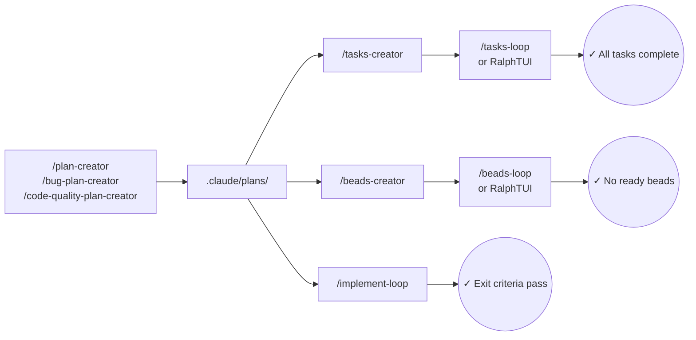

# Essentials for Claude Code

**Plan first. Implement until done.** No more "it's complete" when tests are failing.

## The Problem

Claude Code is powerful, but without structure it can:
- Start coding before understanding the full picture
- Lose track of what's done when context gets long
- Say "done" when tests are still failing
- Hallucinate on large features that exceed context

**The Solution:** Plan first, then implement until exit criteria pass.

```bash
/plan-creator Add user authentication with JWT
/implement-loop .claude/plans/user-auth-3k7f2-plan.md
# Loop continues until ALL exit criteria pass
```

## Install

```bash
/plugin marketplace add GantisStorm/essentials-claude-code
/plugin install essentials@essentials-claude-code
mkdir -p .claude/plans .claude/maps .claude/prompts .claude/prd
# Note: .beads/ directory is created automatically by `bd init` if using Beads workflow
```

## Workflows

> **80% of tasks need only the Simple workflow.** Start there. Escalate only when you hit problems (hallucinations, lost context, multi-day features).

| Workflow | Commands | Execution | When to Use |
|----------|----------|-----------|-------------|
| **Simple** | `/plan-creator` → `/implement-loop` | Internal | Single session, most tasks (start here) |
| **Tasks** | Plan → `/tasks-creator` | `/tasks-loop` or RalphTUI | RalphTUI dashboard, prd.json format |
| **Beads** | Plan → `/beads-creator` | `/beads-loop` or RalphTUI | Multi-session, context loss, hallucinations |



**Simple:** Single-session features, bug fixes, refactoring. `/plan-creator` analyzes codebase → `/implement-loop` executes until exit criteria pass.

**Tasks:** RalphTUI integration with prd.json format. `/plan-creator` → `/tasks-creator` creates prd.json → `/tasks-loop` executes internally or `ralph-tui run --prd` for TUI dashboard.

**Beads:** Persistent memory across sessions. `/plan-creator` → `/beads-creator` creates self-contained beads → `/beads-loop` executes internally or `ralph-tui run --tracker beads` for TUI dashboard.

## Commands

### Planning

| Command | Purpose | Output |
|---------|---------|--------|
| `/plan-creator <task>` | Create implementation plan | `.claude/plans/{task}-{hash}-plan.md` |
| `/bug-plan-creator <error> <desc>` | Bug investigation plan | `.claude/plans/bug-fix-{desc}-{hash}-plan.md` |
| `/code-quality-plan-creator <files>` | Code quality analysis | `.claude/plans/code-quality-{file}-{hash}-plan.md` |
| `/tasks-creator <plan>` | Convert plan → prd.json | `./prd.json` |
| `/beads-creator <plan>` | Convert plan → Beads | Beads database |

### Loops

All loops run until complete. Optional: `--max-iterations N` to limit iterations.

| Command | Completes When | Cancel |
|---------|----------------|--------|
| `/implement-loop <plan>` | Exit criteria pass | `/cancel-implement` |
| `/tasks-loop [prd-path]` | All tasks `passes: true` | `/cancel-tasks` |
| `/beads-loop [--label X]` | No ready beads | `/cancel-beads` |

### Utilities

| Command | Purpose |
|---------|---------|
| `/codemap-creator [dir]` | Generate JSON code map |
| `/document-creator <dir>` | Generate DEVGUIDE.md |
| `/prompt-creator <desc>` | Create quality prompts |
| `/mr-description-creator` | Create PR/MR description |

### Project Outputs

| Directory | Contents |
|-----------|----------|
| `.claude/plans/` | Architectural plans |
| `.claude/maps/` | Code maps |
| `.claude/prompts/` | Generated prompts |
| `.claude/prd/` | Tasks files (RalphTUI format) |
| `.beads/` | Beads database (created by `bd init`) |

## Model Configuration

All commands default to `opus` for maximum quality. You can customize the model for any command by editing its frontmatter.

### Changing a Command's Model

Each command file in `essentials/commands/*.md` has a `model` field in its YAML frontmatter:

```yaml
---
description: "Execute beads iteratively..."
argument-hint: "[--label <label>]"
model: opus   # Change to: opus, sonnet, or haiku
---
```

**Available models:**
- `opus` — Best quality, complex reasoning (default)
- `sonnet` — Balanced quality/cost
- `haiku` — Fast and cheap, simple tasks

### Files to Modify

| To change... | Edit |
|--------------|------|
| `/implement-loop` | `essentials/commands/implement-loop.md` (line 6) |
| `/tasks-loop` | `essentials/commands/tasks-loop.md` (line 6) |
| `/beads-loop` | `essentials/commands/beads-loop.md` (line 6) |
| `/cancel-implement` | `essentials/commands/cancel-implement.md` (line 5) |
| `/cancel-tasks` | `essentials/commands/cancel-tasks.md` (line 5) |
| `/cancel-beads` | `essentials/commands/cancel-beads.md` (line 5) |
| `/plan-creator` | `essentials/commands/plan-creator.md` (line 6) |
| Any creator | `essentials/commands/<name>.md` |

### Cost Optimization Example

To reduce costs for iterative execution, change loops and cancels to `haiku`:

```bash
# In essentials/commands/implement-loop.md, change:
model: opus
# to:
model: haiku
```

This reduces costs for repetitive loop iterations while preserving quality for planning tasks.

## Best Practices

1. **Start simple** — 80% of tasks need only `/plan-creator` → `/implement-loop`. Scale up only when you hit problems.
2. **Exit criteria are non-negotiable** — Not "tests pass" but exact commands: `npm test -- auth`.
3. **Review before looping** — Loops execute autonomously. Editing plans is cheap; debugging bad code is expensive.
4. **Token cost is a tradeoff** — The full pipeline copies code multiple times (plan → tasks/beads) for context recovery. This is intentional but expensive—don't use it for simple tasks.

| After | Review |
|-------|--------|
| Plan | Architecture, file structure, exit criteria |
| Tasks | Task descriptions contain full code, not summaries |
| Beads | Bead descriptions, code snippets, dependencies |

## Context Chain

Each output includes back-references for disaster recovery:

**Tasks Path:**
```
.claude/plans/billing-plan.md        ◄── SOURCE OF TRUTH
  │
  └──► prd.json
       ## Context (disaster recovery ONLY)
       **Plan Reference**: .claude/plans/billing-plan.md
       + FULL code in task description (self-contained)
```

**Beads Path:**
```
.claude/plans/billing-plan.md        ◄── SOURCE OF TRUTH
  │
  └──► beads
       ## Context Chain (disaster recovery ONLY)
       **Plan Reference**: .claude/plans/billing-plan.md
       + FULL code in bead description (self-contained)
```

When context compacts mid-loop, tasks/beads are self-contained (full code in description) but include back-references for recovery.

## How Loops Work

All loops use the [Ralph Wiggum](https://github.com/anthropics/claude-code/tree/main/plugins/ralph-wiggum) stop-hook pattern: setup creates a marker file, stop hooks intercept exit attempts, and the loop continues until completion criteria pass.

### `/implement-loop`

1. Read plan file and create todos with TodoWrite
2. Implement each todo following plan instructions
3. Run exit criteria verification command from plan
4. **Completion:** Exit criteria command passes

State: `.claude/implement-loop.local.md` (contains plan path, iteration count)

### `/tasks-loop`

1. Read `prd.json` and find pending tasks (`passes: false`)
2. Pick highest priority task with no blocking dependencies
3. Implement using self-contained task description
4. Update `passes: true` in prd.json
5. **Completion:** All tasks have `passes: true`

State: `.claude/tasks-loop-active` (marker), `prd.json` (task state)

### `/beads-loop`

1. Run `bd ready` to find tasks with no blockers
2. Pick highest priority ready task
3. Run `bd update <id> --status in_progress`
4. Implement using self-contained bead description
5. Run `bd close <id>` when complete
6. **Completion:** `bd ready` returns no tasks

State: `.claude/beads-loop-active` (marker), beads DB (task state)

## Requirements

| Tool | For | Install |
|------|-----|---------|
| Beads | `/beads-creator`, `/beads-loop` | [steveyegge/beads](https://github.com/steveyegge/beads) |
| RalphTUI | Alternative execution for Tasks/Beads | [subsy/ralph-tui](https://github.com/subsy/ralph-tui) (optional) |
| Built-in LSP | `/code-quality-plan-creator`, `/codemap-creator`, `/document-creator` | Already included in Claude Code |
| Context7 | `/plan-creator`, `/prompt-creator` | MCP server (optional) |
| SearXNG | `/plan-creator`, `/prompt-creator` | MCP server (optional) |

**Note on MCP servers:** Context7 and SearXNG enhance plan/prompt quality with external documentation and web search but are not required.

**Note on RalphTUI:** RalphTUI provides a visual TUI dashboard for monitoring task execution. Both `/tasks-loop` and `/beads-loop` work without it. Beads are created with `ralph` label by default for RalphTUI compatibility—custom labels require editing `beads-creator-default.md`.

## Guides

- [WORKFLOW-SIMPLE.md](WORKFLOW-SIMPLE.md) — Single-session features, bug fixes, refactoring
- [WORKFLOW-TASKS.md](WORKFLOW-TASKS.md) — RalphTUI integration with prd.json format
- [WORKFLOW-BEADS.md](WORKFLOW-BEADS.md) — Persistent memory that survives sessions and context compaction
- [COMPARISON.md](COMPARISON.md) — Why verification-enforced completion matters (code-first vs conversation vs essentials)

## License

MIT
