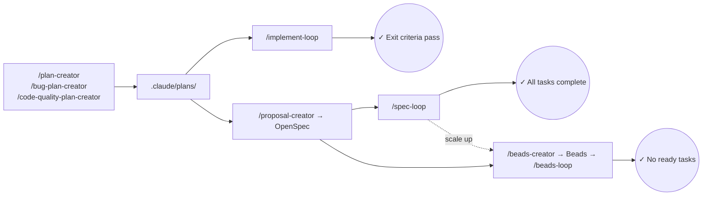
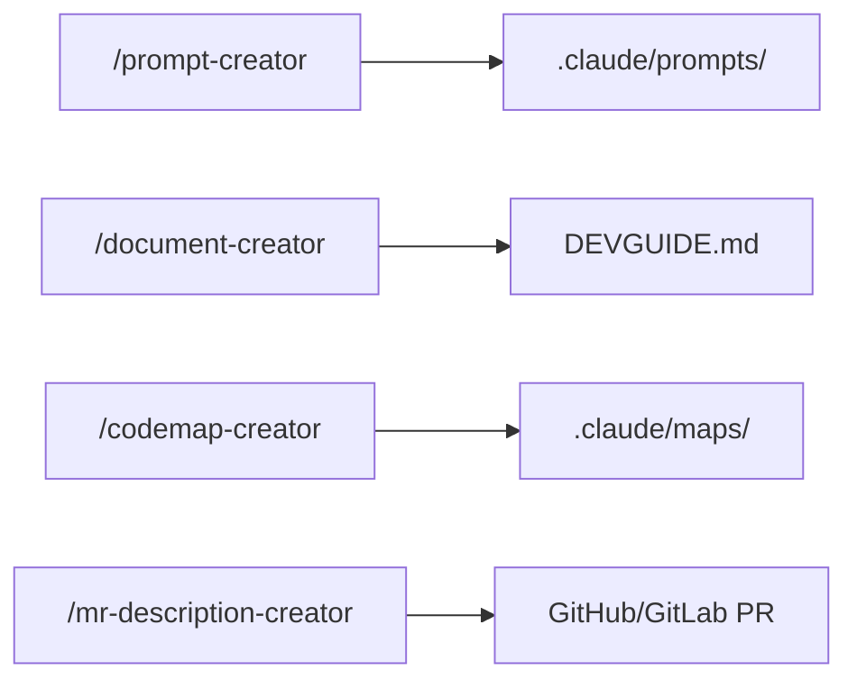

# Essentials for Claude Code

**Stop coding in circles.** This plugin gives Claude Code the ability to plan before it codes, then iterate until the job is actually done.

## The Problem

Claude Code is powerful, but without structure it can:
- Start coding before understanding the full picture
- Lose track of what's done when context gets long
- Say "done" when tests are still failing
- Hallucinate on large features that exceed context

## The Solution

**Plan first, then implement until exit criteria pass.**

```
/plan-creator Add user authentication with JWT

# Claude analyzes your codebase, creates an architectural plan
# with implementation steps and exit criteria (tests, lint, build)

/implement-loop .claude/plans/user-auth-3k7f2-plan.md

# Claude implements step by step, runs verification after each change
# Loop continues until ALL exit criteria pass
# No more "I think I'm done" - it's done when tests are green
```

## Three Workflows

Choose based on your task size:

| Size | Workflow | Commands |
|------|----------|----------|
| **Small** | Plan → Implement | `/plan-creator` → `/implement-loop` |
| **Medium** | Plan → Spec → Implement | Add [OpenSpec](https://github.com/Fission-AI/OpenSpec) → `/spec-loop` |
| **Large** | Plan → Spec → Beads → Implement | Add [Beads](https://github.com/steveyegge/beads) → `/beads-loop` |

**Small:** Feature fits in one session. Plan it, implement it, done.

**Medium:** Need stakeholder review or spec validation before coding. OpenSpec creates a proposal you can review, then `/spec-loop` implements it task by task.

**Large:** Too big for one context window. Beads breaks work into atomic tasks that survive session boundaries. Pick up exactly where you left off.

**Context Chain:** Plan → Spec → Beads with back-references at each level. When context is compacted, the chain enables full recovery from the source plan.


```mermaid
flowchart LR
    A["/plan-creator<br/>/bug-plan-creator<br/>/code-quality-plan-creator"] --> B[".claude/plans/"]

    B --> C["/implement-loop"]
    B --> D["/proposal-creator → OpenSpec"]
    D --> E["/spec-loop"]
    D --> F["/beads-creator → Beads → /beads-loop"]

    C --> G(("✓ Exit criteria pass"))
    E --> H(("✓ All tasks complete"))
    F --> I(("✓ No ready tasks"))

    E -.->|"scale up"| F
```


```mermaid
flowchart LR
    P["/prompt-creator"] --> P1[".claude/prompts/"]
    D["/document-creator"] --> D1["DEVGUIDE.md"]
    C["/codemap-creator"] --> C1[".claude/maps/"]
    M["/mr-description-creator"] --> M1["GitHub/GitLab PR"]
```

## Install

```bash
/plugin marketplace add GantisStorm/essentials-claude-code
/plugin install essentials@essentials-claude-code

mkdir -p .claude/plans .claude/maps .claude/prompts
```

## Commands at a Glance

**Planning** — Create plans with exit criteria
- `/plan-creator` — Features, refactoring
- `/bug-plan-creator` — Bug investigation with root cause
- `/code-quality-plan-creator` — LSP-powered quality analysis
- `/proposal-creator` — Convert plans to OpenSpec proposals

**Implementation** — Iterate until done
- `/implement-loop` — Execute plans until exit criteria pass
- `/spec-loop` — Execute OpenSpec changes until all tasks complete
- `/beads-loop` — Execute Beads issues until no ready tasks remain

**Creators** — Generate artifacts
- `/document-creator` — DEVGUIDE.md from your codebase
- `/codemap-creator` — JSON symbol map with unused code detection
- `/prompt-creator` — Transform descriptions into quality prompts

**Git** — MR/PR automation
- `/mr-description-creator` — Create MR/PR with auto-generated description

## Quick Examples

```bash
# Plan and implement a feature
/plan-creator Add dark mode toggle to settings
/implement-loop .claude/plans/dark-mode-toggle-a1b2c-plan.md

# Convert plan to OpenSpec proposal
/proposal-creator .claude/plans/dark-mode-toggle-a1b2c-plan.md
# Or from description
/proposal-creator Add OAuth2 authentication with Google

# Investigate and fix a bug
/bug-plan-creator "TypeError at auth.py:45" "Login fails for new users"
/implement-loop .claude/plans/bug-fix-login-d3e4f-plan.md

# Analyze code quality
/code-quality-plan-creator src/auth.ts src/api.ts

# Create MR/PR description
/mr-description-creator
```

## Documentation

| Guide | What You'll Learn |
|-------|-------------------|
| [GUIDE.md](GUIDE.md) | All commands, architectural planning principles |
| [WORKFLOW-SIMPLE.md](WORKFLOW-SIMPLE.md) | Small tasks: plan → implement |
| [WORKFLOW-SPEC.md](WORKFLOW-SPEC.md) | Medium tasks: add spec validation |
| [WORKFLOW-BEADS.md](WORKFLOW-BEADS.md) | Large tasks: persistent task tracking |

## Requirements

- **Claude Code** CLI
- **Serena MCP** — For LSP-powered commands (`/code-quality-plan-creator`, `/document-creator`, `/codemap-creator`)

## License

MIT
