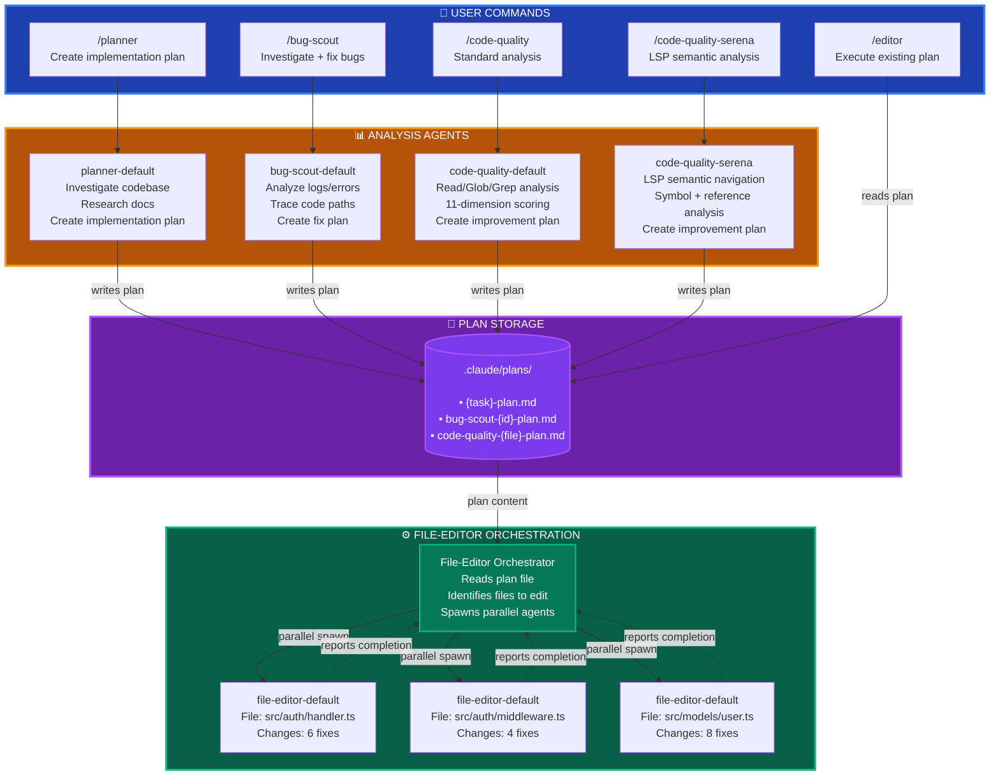
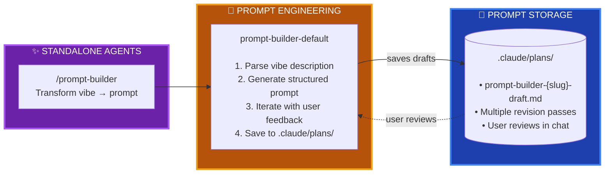
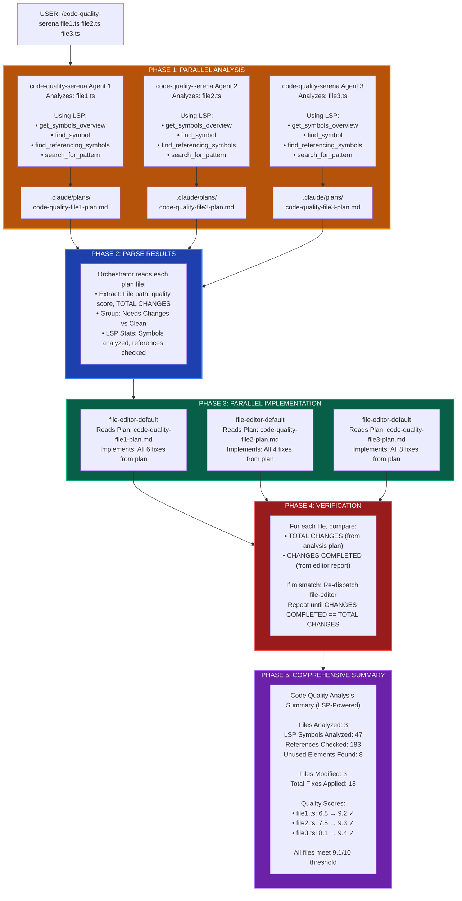

# Essentials for Claude Code

A comprehensive multi-agent orchestration framework for Claude Code. Features deep planning, bug investigation, code quality analysis (standard and LSP-powered), and parallel file editing capabilities.

## Core Concept: Multi-Agent Workflows

### Plan-Driven Workflow (with File-Editor Orchestration)


```mermaid
flowchart TD
    subgraph commands["🎯 USER COMMANDS"]
        planner_cmd["/planner<br/>Create implementation plan"]
        editor_cmd["/editor<br/>Execute existing plan"]
        bug_cmd["/bug-scout<br/>Investigate + fix bugs"]
        quality_cmd["/code-quality<br/>Standard analysis"]
        serena_cmd["/code-quality-serena<br/>LSP semantic analysis"]
    end

    subgraph analysis["📊 ANALYSIS AGENTS"]
        planner_agent["planner-default<br/>Investigate codebase<br/>Research docs<br/>Create implementation plan"]
        bug_agent["bug-scout-default<br/>Analyze logs/errors<br/>Trace code paths<br/>Create fix plan"]
        quality_agent["code-quality-default<br/>Read/Glob/Grep analysis<br/>11-dimension scoring<br/>Create improvement plan"]
        serena_agent["code-quality-serena<br/>LSP semantic navigation<br/>Symbol + reference analysis<br/>Create improvement plan"]
    end

    subgraph storage["💾 PLAN STORAGE"]
        plans[(".claude/plans/<br/><br/>• {task}-plan.md<br/>• bug-scout-{id}-plan.md<br/>• code-quality-{file}-plan.md")]
    end

    subgraph execution["⚙️ FILE-EDITOR ORCHESTRATION"]
        orchestrator["File-Editor Orchestrator<br/>Reads plan file<br/>Identifies files to edit<br/>Spawns parallel agents"]
        editor1["file-editor-default<br/>File: src/auth/handler.ts<br/>Changes: 6 fixes"]
        editor2["file-editor-default<br/>File: src/auth/middleware.ts<br/>Changes: 4 fixes"]
        editor3["file-editor-default<br/>File: src/models/user.ts<br/>Changes: 8 fixes"]
    end

    planner_cmd --> planner_agent
    bug_cmd --> bug_agent
    quality_cmd --> quality_agent
    serena_cmd --> serena_agent

    planner_agent -->|"writes plan"| plans
    bug_agent -->|"writes plan"| plans
    quality_agent -->|"writes plan"| plans
    serena_agent -->|"writes plan"| plans

    editor_cmd -->|"reads plan"| plans
    plans -->|"plan content"| orchestrator

    orchestrator -->|"parallel spawn"| editor1
    orchestrator -->|"parallel spawn"| editor2
    orchestrator -->|"parallel spawn"| editor3

    editor1 -.->|"reports completion"| orchestrator
    editor2 -.->|"reports completion"| orchestrator
    editor3 -.->|"reports completion"| orchestrator

    style commands fill:#1e40af,stroke:#3b82f6,stroke-width:3px,color:#fff
    style analysis fill:#b45309,stroke:#f59e0b,stroke-width:3px,color:#fff
    style storage fill:#6b21a8,stroke:#a855f7,stroke-width:3px,color:#fff
    style execution fill:#065f46,stroke:#10b981,stroke-width:3px,color:#fff
    style orchestrator fill:#047857,stroke:#10b981,stroke-width:2px,color:#fff
    style plans fill:#7c3aed,stroke:#a855f7,stroke-width:2px,color:#fff
```

### Independent Workflow (No File-Editor)


```mermaid
flowchart LR
    subgraph standalone["✨ STANDALONE AGENTS"]
        prompt_cmd["/prompt-builder<br/>Transform vibe → prompt"]
    end

    subgraph prompt_work["📝 PROMPT ENGINEERING"]
        prompt_agent["prompt-builder-default<br/><br/>1. Parse vibe description<br/>2. Generate structured prompt<br/>3. Iterate with user feedback<br/>4. Save to .claude/plans/"]
    end

    subgraph prompt_storage["💾 PROMPT STORAGE"]
        prompt_files[(".claude/plans/<br/><br/>• prompt-builder-{slug}-draft.md<br/>• Multiple revision passes<br/>• User reviews in chat")]
    end

    prompt_cmd --> prompt_agent
    prompt_agent -->|"saves drafts"| prompt_files
    prompt_files -.->|"user reviews"| prompt_agent

    style standalone fill:#6b21a8,stroke:#a855f7,stroke-width:3px,color:#fff
    style prompt_work fill:#b45309,stroke:#f59e0b,stroke-width:3px,color:#fff
    style prompt_storage fill:#1e40af,stroke:#3b82f6,stroke-width:3px,color:#fff
```

## Features

### 1. **Planner** (`/planner`)
Comprehensive architectural planning with multi-phase investigation:
- Codebase investigation with file:line references
- External documentation research (via MCP)
- Risk analysis and mitigation planning
- Per-file implementation instructions
- 7-pass revision process for quality assurance
- Auto-spawns file-editor agents for implementation

### 2. **Bug Scout** (`/bug-scout`)
Deep bug investigation and automatic fix implementation:
- Error signal extraction from logs/stack traces
- Code path tracing from entry to failure
- Line-by-line analysis of suspicious code
- Regression analysis to find what broke
- Precise fix plans with before/after code
- Auto-spawns file-editor agents to apply fixes

### 3. **Code Quality** (`/code-quality` and `/code-quality-serena`)

Two complementary approaches for comprehensive code analysis:

#### **Standard Analysis** (`/code-quality`)
Traditional file-based analysis with standard tools:
- Uses Read, Glob, Grep for code navigation
- 11-dimension quality scoring (SOLID, DRY, KISS, YAGNI, OWASP)
- Cognitive and cyclomatic complexity metrics
- Technical debt estimation
- Project standards compliance checking
- Auto-spawns file-editor agents to implement fixes
- Targets 9.1/10 minimum quality score

#### **LSP Semantic Analysis** (`/code-quality-serena`) ⭐ NEW
Advanced semantic code navigation using Serena LSP:
- **Accurate Symbol Discovery**: Language server understands code structure
  - Classes, methods, functions, interfaces with exact locations
  - Type-aware analysis with LSP symbol kinds
- **Precise Reference Tracking**: Who calls what, across the entire codebase
  - `find_referencing_symbols` for accurate call hierarchy
  - Cross-file reference checking
- **Better Dead Code Detection**: LSP verifies zero-reference symbols
  - Unused public API detection (verified against consumers)
  - Orphaned code identification
- **Project-Wide Context**: Semantic understanding beyond text search
  - Consumer usage analysis (files importing the target)
  - Sibling file consistency checking
- All standard features (SOLID, DRY, KISS, YAGNI, OWASP, 9.1/10 target)
- Same auto-fix workflow with file-editor agents

**When to Use Each:**
- **`/code-quality`**: Quick analysis, simpler projects, no LSP setup needed
- **`/code-quality-serena`**: Larger codebases, accurate refactoring, semantic accuracy matters

### 4. **File Editor** (`/editor`)
Parallel file modification from implementation plans:
- Reads plans from `.claude/plans/`
- Implements changes atomically and defensively
- Security checklist verification
- Regression loop to clean up artifacts
- Detailed change tracking and rollback documentation

### 5. **Prompt Builder** (`/prompt-builder`)
Iterative prompt engineering from vibe descriptions:
- Transforms rough ideas into structured prompts
- Anti-pattern elimination (no vague phrases)
- Multiple iteration support with user feedback
- Drafts saved to `.claude/plans/`

## Installation

### Step 1: Add the Marketplace

```bash
/plugin marketplace add GantisStorm/essentials-claude-code
```

### Step 2: Install the Plugin

```bash
/plugin install essentials@essentials-claude-code
```

Or enable in `.claude/settings.local.json`:

```json
{
  "enabledPlugins": {
    "essentials@essentials-claude-code": true
  }
}
```

### Step 3: Create Required Directories (in your project)

The agents need these directories in your project:

```bash
mkdir -p .claude/plans
mkdir -p .claude/skills
```

### Step 4: Create Project-Specific Code Quality Skill

Create `.claude/skills/code-quality.md` tuned to your project's tooling:

```markdown
# Code Quality

Run code quality checks for this project.

## Commands

```bash
# Linting and formatting
your-linter . --fix
your-formatter .

# Type checking
your-type-checker
```

## Configuration

- Line length: [your limit]
- Linter config: [your config file]
- Type checker config: [your config file]
```

This skill is referenced by the code-quality agents to run your project's specific quality checks.

### Step 5 (Optional): Set Up Serena LSP for Semantic Analysis

To use `/code-quality-serena`, you need Serena MCP configured:

1. **Install Serena MCP**: Follow [Serena installation docs](https://github.com/toolness/serena)
2. **Configure for your project**: Serena will use LSP servers for your languages
3. **Test**: Verify LSP is working with a simple symbol search

Once configured, `/code-quality-serena` will use semantic code navigation for more accurate analysis.

## Usage

### Planning & Implementation

```bash
# Create and execute an implementation plan
/planner Add OAuth2 authentication with Google login

# Execute a specific plan on files
/editor .claude/plans/oauth2-plan.md src/auth/handler src/auth/middleware
```

### Bug Investigation

```bash
# Investigate and fix a bug
/bug-scout "TypeError: 'NoneType' object at auth_handler.py:45" "Login fails when user has no profile"

# With log file
/bug-scout ./logs/error.log "API returns 500 on POST /users"
```

### Code Quality

```bash
# Standard analysis (Read/Glob/Grep)
/code-quality src/services/auth src/services/user src/models/user

# LSP semantic analysis (more accurate)
/code-quality-serena src/services/auth src/services/user src/models/user

# Single file analysis
/code-quality src/services/payment
/code-quality-serena src/services/payment
```

### Prompt Building

```bash
# Create a new prompt from a vibe
/prompt-builder "a prompt that reviews PRs for security issues"

# Refine based on feedback
"add more OWASP examples and focus on injection attacks"

# When satisfied
"done"
```

## Architecture

### Agent Hierarchy

```
Orchestrator Commands
├── /planner
│   ├── planner-default (investigation + planning)
│   └── file-editor-default (parallel, per-file)
│
├── /bug-scout
│   ├── bug-scout-default (investigation + fix plan)
│   └── file-editor-default (parallel, per-file)
│
├── /code-quality
│   ├── code-quality-default (standard analysis + plan)
│   └── file-editor-default (parallel, per-file)
│
├── /code-quality-serena ⭐ NEW
│   ├── code-quality-serena (LSP semantic analysis + plan)
│   └── file-editor-default (parallel, per-file)
│
├── /editor
│   └── file-editor-default (parallel, per-file)
│
└── /prompt-builder
    └── prompt-builder-default (iterative refinement)
```

### Code Quality Analysis Workflow


```mermaid
flowchart TD
    user["USER: /code-quality-serena file1.ts file2.ts file3.ts"]

    subgraph phase1["PHASE 1: PARALLEL ANALYSIS"]
        agent1["code-quality-serena Agent 1<br/>Analyzes: file1.ts<br/><br/>Using LSP:<br/>• get_symbols_overview<br/>• find_symbol<br/>• find_referencing_symbols<br/>• search_for_pattern"]
        agent2["code-quality-serena Agent 2<br/>Analyzes: file2.ts<br/><br/>Using LSP:<br/>• get_symbols_overview<br/>• find_symbol<br/>• find_referencing_symbols<br/>• search_for_pattern"]
        agent3["code-quality-serena Agent 3<br/>Analyzes: file3.ts<br/><br/>Using LSP:<br/>• get_symbols_overview<br/>• find_symbol<br/>• find_referencing_symbols<br/>• search_for_pattern"]
        plan1[".claude/plans/<br/>code-quality-file1-plan.md"]
        plan2[".claude/plans/<br/>code-quality-file2-plan.md"]
        plan3[".claude/plans/<br/>code-quality-file3-plan.md"]
    end

    subgraph phase2["PHASE 2: PARSE RESULTS"]
        parse["Orchestrator reads each plan file:<br/>• Extract: File path, quality score, TOTAL CHANGES<br/>• Group: Needs Changes vs Clean<br/>• LSP Stats: Symbols analyzed, references checked"]
    end

    subgraph phase3["PHASE 3: PARALLEL IMPLEMENTATION"]
        editor1["file-editor-default<br/>Reads Plan: code-quality-file1-plan.md<br/>Implements: All 6 fixes from plan"]
        editor2["file-editor-default<br/>Reads Plan: code-quality-file2-plan.md<br/>Implements: All 4 fixes from plan"]
        editor3["file-editor-default<br/>Reads Plan: code-quality-file3-plan.md<br/>Implements: All 8 fixes from plan"]
    end

    subgraph phase4["PHASE 4: VERIFICATION"]
        verify["For each file, compare:<br/>• TOTAL CHANGES (from analysis plan)<br/>• CHANGES COMPLETED (from editor report)<br/><br/>If mismatch: Re-dispatch file-editor<br/>Repeat until CHANGES COMPLETED == TOTAL CHANGES"]
    end

    subgraph phase5["PHASE 5: COMPREHENSIVE SUMMARY"]
        summary["Code Quality Analysis Summary (LSP-Powered)<br/><br/>Files Analyzed: 3<br/>LSP Symbols Analyzed: 47<br/>References Checked: 183<br/>Unused Elements Found: 8<br/><br/>Files Modified: 3<br/>Total Fixes Applied: 18<br/><br/>Quality Scores:<br/>• file1.ts: 6.8 → 9.2 ✓<br/>• file2.ts: 7.5 → 9.3 ✓<br/>• file3.ts: 8.1 → 9.4 ✓<br/><br/>All files meet 9.1/10 threshold"]
    end

    user --> phase1
    agent1 --> plan1
    agent2 --> plan2
    agent3 --> plan3
    plan1 --> phase2
    plan2 --> phase2
    plan3 --> phase2
    phase2 --> phase3
    editor1 --> phase4
    editor2 --> phase4
    editor3 --> phase4
    phase4 --> phase5

    style phase1 fill:#b45309,stroke:#f59e0b,stroke-width:2px,color:#fff
    style phase2 fill:#1e40af,stroke:#3b82f6,stroke-width:2px,color:#fff
    style phase3 fill:#065f46,stroke:#10b981,stroke-width:2px,color:#fff
    style phase4 fill:#991b1b,stroke:#ef4444,stroke-width:2px,color:#fff
    style phase5 fill:#6b21a8,stroke:#a855f7,stroke-width:2px,color:#fff
```

### Plan Storage

All plans are stored in **your project's** `.claude/plans/` directory (not the plugin):
- `{task-slug}-plan.md` - Implementation plans
- `bug-scout-{identifier}-plan.md` - Bug fix plans
- `code-quality-{filename}-plan.md` - Quality improvement plans (both standard and LSP)
- `prompt-builder-{slug}-draft.md` - Prompt drafts

## Directory Structure

```
essentials/
├── agents/
│   ├── bug-scout-default.md        # Bug investigation agent
│   ├── code-quality-default.md     # Code analysis agent (standard)
│   ├── code-quality-serena.md      # Code analysis agent (LSP-powered) ⭐
│   ├── file-editor-default.md      # File modification agent
│   ├── planner-default.md          # Planning agent
│   └── prompt-builder-default.md   # Prompt engineering agent
└── commands/
    ├── bug-scout.md                # /bug-scout command
    ├── code-quality.md             # /code-quality command
    ├── code-quality-serena.md      # /code-quality-serena command ⭐
    ├── editor.md                   # /editor command
    ├── planner.md                  # /planner command
    └── prompt-builder.md           # /prompt-builder command
```

## Key Design Principles

1. **Parallel Execution**: File-editor agents run in parallel for multi-file changes
2. **Plan-Driven**: All complex work flows through plan files in `.claude/plans/`
3. **Minimal Context Pollution**: Agents return minimal output; details stay in plan files
4. **Verification Loops**: All implementations are verified against plan counts
5. **No Git Modifications**: Agents never commit; user reviews and commits manually
6. **Security-First**: All file edits include security checklist verification
7. **Semantic Accuracy** (LSP): Use language servers for accurate code understanding

## LSP vs Standard Analysis Comparison

| Feature | Standard (`/code-quality`) | LSP Serena (`/code-quality-serena`) |
|---------|----------------------------|-------------------------------------|
| **Symbol Discovery** | Text search (Grep) | LSP semantic understanding |
| **Reference Finding** | Pattern matching | Precise cross-file references |
| **Dead Code Detection** | Heuristic-based | LSP-verified zero references |
| **Type Awareness** | Text-based inference | Language server type info |
| **Speed** | Fast (simple text ops) | Fast (LSP indexed) |
| **Setup Required** | None | Serena MCP + LSP config |
| **Accuracy** | Good for most cases | Excellent for refactoring |
| **Best For** | Quick checks, simple projects | Large codebases, complex refactors |

## Requirements

- **Claude Code** - The CLI for orchestration and execution
- **Node.js 18+** - For running Claude Code
- **Serena MCP** (optional) - For `/code-quality-serena` LSP analysis

## License

MIT
