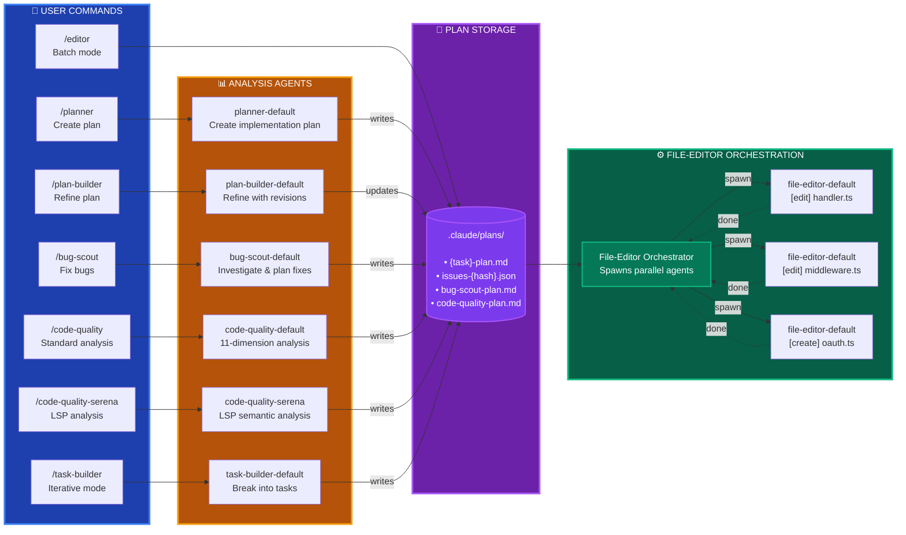
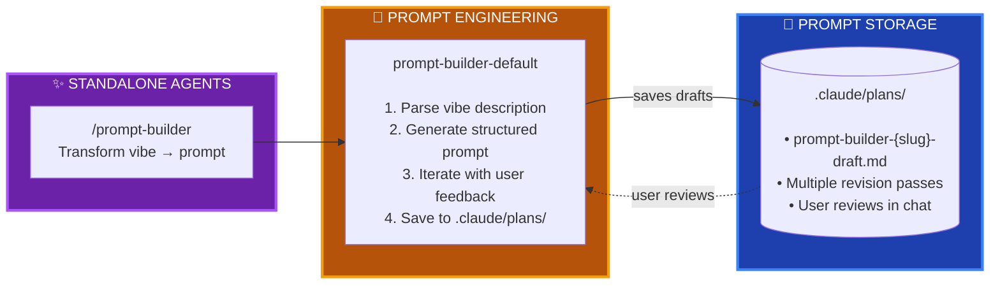

# Essentials for Claude Code

A comprehensive multi-agent orchestration framework for Claude Code. Features deep planning, bug investigation, code quality analysis (standard and LSP-powered), issue-based iterative implementation, and parallel file editing capabilities.

## Core Concept: Multi-Agent Workflows

### Plan-Driven Workflow (with File-Editor Orchestration)


```mermaid
flowchart LR
    subgraph commands["🎯 USER COMMANDS"]
        direction TB
        planner_cmd["/planner<br/>Create plan"]
        optimizer_cmd["/plan-builder<br/>Refine plan"]
        bug_cmd["/bug-scout<br/>Fix bugs"]
        quality_cmd["/code-quality<br/>Standard analysis"]
        serena_cmd["/code-quality-serena<br/>LSP analysis"]
        issue_cmd["/task-builder<br/>Iterative mode"]
        editor_cmd["/editor<br/>Batch mode"]
    end

    subgraph analysis["📊 ANALYSIS AGENTS"]
        direction TB
        planner_agent["planner-default<br/>Create implementation plan"]
        optimizer_agent["plan-builder-default<br/>Refine with revisions"]
        bug_agent["bug-scout-default<br/>Investigate & plan fixes"]
        quality_agent["code-quality-default<br/>11-dimension analysis"]
        serena_agent["code-quality-serena<br/>LSP semantic analysis"]
        issue_agent["task-builder-default<br/>Break into tasks"]
    end

    subgraph storage["💾 PLAN STORAGE"]
        direction TB
        plans[(".claude/plans/<br/><br/>• {task}-plan.md<br/>• issues-{hash}.json<br/>• bug-scout-plan.md<br/>• code-quality-plan.md")]
    end

    subgraph execution["⚙️ FILE-EDITOR ORCHESTRATION"]
        direction TB
        orchestrator["File-Editor Orchestrator<br/>Spawns parallel agents"]
        editor1["file-editor-default<br/>[edit] handler.ts"]
        editor2["file-editor-default<br/>[edit] middleware.ts"]
        editor3["file-editor-default<br/>[create] oauth.ts"]
    end

    %% Command to Agent connections
    planner_cmd --> planner_agent
    optimizer_cmd --> optimizer_agent
    bug_cmd --> bug_agent
    quality_cmd --> quality_agent
    serena_cmd --> serena_agent
    issue_cmd --> issue_agent
    editor_cmd --> plans

    %% Analysis agents to storage
    planner_agent -->|"writes"| plans
    optimizer_agent -->|"updates"| plans
    bug_agent -->|"writes"| plans
    quality_agent -->|"writes"| plans
    serena_agent -->|"writes"| plans
    issue_agent -->|"writes"| plans

    %% Storage to execution
    plans --> orchestrator

    %% Orchestrator to editors
    orchestrator -->|"spawn"| editor1
    orchestrator -->|"spawn"| editor2
    orchestrator -->|"spawn"| editor3

    %% Editor feedback (dotted)
    editor1 -.->|"done"| orchestrator
    editor2 -.->|"done"| orchestrator
    editor3 -.->|"done"| orchestrator

    style commands fill:#1e40af,stroke:#3b82f6,stroke-width:3px,color:#fff
    style analysis fill:#b45309,stroke:#f59e0b,stroke-width:3px,color:#fff
    style storage fill:#6b21a8,stroke:#a855f7,stroke-width:3px,color:#fff
    style execution fill:#065f46,stroke:#10b981,stroke-width:3px,color:#fff
    style orchestrator fill:#047857,stroke:#10b981,stroke-width:2px,color:#fff
    style plans fill:#7c3aed,stroke:#a855f7,stroke-width:2px,color:#fff
```

### Independent Workflow (No File-Editor)


```mermaid
flowchart LR
    subgraph standalone["✨ STANDALONE AGENTS"]
        prompt_cmd["/prompt-builder<br/>Transform vibe → prompt"]
    end

    subgraph prompt_work["📝 PROMPT ENGINEERING"]
        prompt_agent["prompt-builder-default<br/><br/>1. Parse vibe description<br/>2. Generate structured prompt<br/>3. Iterate with user feedback<br/>4. Save to .claude/plans/"]
    end

    subgraph prompt_storage["💾 PROMPT STORAGE"]
        prompt_files[(".claude/plans/<br/><br/>• prompt-builder-{slug}-draft.md<br/>• Multiple revision passes<br/>• User reviews in chat")]
    end

    prompt_cmd --> prompt_agent
    prompt_agent -->|"saves drafts"| prompt_files
    prompt_files -.->|"user reviews"| prompt_agent

    style standalone fill:#6b21a8,stroke:#a855f7,stroke-width:3px,color:#fff
    style prompt_work fill:#b45309,stroke:#f59e0b,stroke-width:3px,color:#fff
    style prompt_storage fill:#1e40af,stroke:#3b82f6,stroke-width:3px,color:#fff
```

## Naming Pattern: Builder Agents

Agents with **"-builder"** in their name follow an **iterative loop pattern with user control** at each iteration:

### Builder Meta-Loop Pattern

All builders implement a systematic **iterative refinement loop** where the user has control at each iteration:

| Agent | Loop Type | User Control Point | Iterations |
|-------|-----------|-------------------|------------|
| **`plan-builder`** | Multi-pass revision loop | After each revision pass (6-7 passes) | User reviews git-style diff for each pass, can request changes or skip to next |
| **`task-builder`** | Task-by-task orchestration loop | After each task presented | User chooses: [1] Implement, [2] Skip, [3] View details, [4] Pause/Compact, [5] Abort |
| **`prompt-builder`** | Iterative prompt refinement loop | After each draft revision | User provides feedback for next iteration or accepts current version |

**Key Characteristics of All Builders:**
- **Iterative**: Work happens in discrete iterations/passes, not all at once
- **User-Driven**: User explicitly approves/rejects each iteration
- **Resumable**: Can pause and resume from any iteration
- **Incremental Progress**: Each iteration builds on previous results
- **Transparent**: User sees exactly what changed in each iteration
- **Controllable**: User can abort, skip, or request modifications mid-loop

This contrasts with **non-builder agents** (planner, bug-scout, code-quality) which run to completion and present a single result for user review.

## Features

### 1. **Planner** (`/planner`)
Comprehensive architectural planning agent with complete end-to-end planning workflow:

**Planning Process:**
- **Phase 1: Code Investigation** - Systematic codebase exploration using Glob/Grep/Read with file:line references
- **Phase 2: External Documentation Research** - MCP-based research (Context7, SearxNG) for API/library details
- **Phase 3: Synthesis** - Transform findings into detailed architectural narrative with stakeholder analysis
- **Phase 4: Per-File Instructions** - Precise implementation steps with exact signatures, line numbers, dependencies
- **Phase 5: 7-Pass Revision Process** - Quality assurance through multiple validation passes:
  - Pass 1: Initial Draft
  - Pass 2: Structural Validation (all required sections present)
  - Pass 3: Anti-Pattern Scan (eliminate vague phrases like "add appropriate", "as needed")
  - Pass 4: Dependency Chain Validation (every Dependency has a Provider, exact signature matching)
  - Pass 5: Consumer Simulation (file-editor agent perspective check)
  - Pass 6: Requirements Traceability (every requirement maps to file changes)
  - Pass 7: Final Quality Score (minimum 40/50 total, no dimension below 8/10)

**Plan Content:**
- Risk analysis with mitigation strategies and rollback plans
- Alternative approaches considered with trade-offs
- Testing strategy with unit/integration test requirements
- Success metrics and verification checklist
- Visual architecture diagrams (ASCII art)
- Complete revision history documenting all 7 passes

**Orchestration Workflow:**
- Grammar/spell checks user's task description before planning
- Launches `planner-default` agent in background
- Writes comprehensive plan to `.claude/plans/{task-slug}-{hash5}-plan.md`
- Guides user to choose implementation approach:
  - **Option 1**: `/plan-builder` - Refine plan with git-style revision tracking (optional)
  - **Option 2**: `/editor` - Batch mode for simple plans (<5 files)
  - **Option 3**: `/issue-builder` - Iterative mode for complex plans (>5 files)

### 2. **Bug Scout** (`/bug-scout`)
Deep bug investigation with systematic analysis and automatic fix implementation:

**Investigation Process:**
- **Phase 0: Error Signal Extraction** - Parse logs, stack traces, and diagnostic output to extract error signals
- **Phase 1: Project Context Gathering** - Read documentation (CLAUDE.md, README) and analyze recent git changes (view-only)
- **Phase 2: Code Path Tracing** - Map complete execution path from entry point to failure, track data flow
- **Phase 2.5: Reflection Checkpoint** - ReAct reasoning loop validates call chain completeness, evidence sufficiency, and suspicious section identification
- **Phase 3: Line-by-Line Deep Analysis** - Deep inspection of suspicious code sections with bug pattern detection (null checks, bounds, types, race conditions)
- **Phase 4: Regression Analysis Loop** - Identify what changed that broke things using git history and change impact mapping
- **Phase 4.5: Reflection Checkpoint** - ReAct reasoning loop validates root cause confidence (High/Medium/Low), evidence strength, and contributing factors
- **Phase 5: Fix Plan Generation** - Select fix strategy, generate precise specifications with exact file:line locations and before/after code
- **Phase 6: Write Plan to File** - Save comprehensive plan to `.claude/plans/bug-scout-{identifier}-{hash5}-plan.md`
- **Phase 7: Minimal Report to Orchestrator** - Return only essential metadata (severity, confidence, plan file path)

**Orchestration Workflow:**
- **Diagnostic Execution**: Runs user-requested commands (docker logs, journalctl, custom diagnostics)
- **Risk Validation Gate**: User confirmation required for CRITICAL severity or LOW confidence findings
- **Auto-Fix Implementation**: Spawns file-editor agents in parallel to apply fixes
- **Verification Loop**: Ensures all fixes match TOTAL CHANGES count, re-dispatches if incomplete
- **Quality Scoring**: 6-dimension rubric (Error Signal Extraction 15%, Code Path Tracing 20%, Line-by-Line Depth 20%, Regression Analysis 15%, Root Cause Confidence 15%, Fix Precision 15%) targeting 9-10/10

**Key Features:**
- Evidence-based conclusions with concrete proof (stack trace + code analysis + git history)
- Self-critique at reflection checkpoints to avoid premature conclusions
- Severity levels (Critical/High/Medium/Low) and confidence tracking (High/Medium/Low)
- View-only git commands (diff, status, log, blame) - never modifies repository state
- Minimal context pollution - all investigation details stay in plan file

### 3. **Code Quality** (`/code-quality` and `/code-quality-serena`)

Two complementary approaches for comprehensive code analysis:

#### **Standard Analysis** (`/code-quality`)
Comprehensive file-based code quality analysis with systematic multi-phase process:

**7-Phase Analysis Process:**
- **Phase 0: Context Gathering** - Read project docs (CLAUDE.md, README, devguides), find consumers (who imports this file), analyze sibling files and tests, extract project coding standards
- **Phase 1: Code Element Extraction** - Catalog ALL code elements: imports (with usage tracking), globals/constants, classes (with methods and variables), functions (with parameters and locals), type definitions
- **Phase 2: Scope & Visibility Analysis** - Check private element usage correctness, audit public elements (used externally?), detect unused elements (including unused interfaces/types)
- **Phase 3: Call Hierarchy Mapping** - Build complete call graph, identify entry points, find orphaned/dead code, detect circular dependencies
- **Phase 3.5: ReAct Reflection Checkpoint** - Self-verification: element mapping complete? scope analysis accurate? call hierarchy correct? context aligned with project standards?
- **Phase 4: Quality Issue Identification** - Scan 15+ categories including code smells, SOLID violations, DRY/KISS/YAGNI, security (OWASP Top 10), performance, concurrency, test quality, project standards compliance, cross-file consistency
- **Phase 4.5: ReAct Reflection Checkpoint** - Validate: all 11 quality dimensions checked? every finding has evidence? false positives eliminated? improvements feasible?
- **Phase 5: Improvement Plan Generation** - Prioritize issues (Critical/High/Medium/Low), create specific fixes with exact line numbers and before/after code examples
- **Phase 6: Write Plan to File** - Save complete analysis to `.claude/plans/code-quality-{filename}-{hash5}-plan.md` with all context, scores, and implementation steps
- **Phase 7: Minimal Report to Orchestrator** - Return only plan file path and summary stats (avoids context pollution)

**Quality Scoring & Metrics:**
- **11-Dimension Scoring**: Code Organization (12%), Naming Quality (10%), Scope Correctness (10%), Type Safety (12%), No Dead Code (8%), No Duplication/DRY (8%), Error Handling (10%), Modern Patterns (5%), SOLID Principles (10%), Security/OWASP (10%), Cognitive Complexity (5%)
- **Advanced Metrics**: Cyclomatic complexity, Halstead metrics (Volume, Difficulty, Effort, Predicted Bugs), ABC metrics (Assignment/Branch/Condition), Maintainability Index, CBO (Coupling Between Objects), LCOM (Lack of Cohesion in Methods), RFC (Response for Complexity), WMC (Weighted Methods per Class)
- **Minimum 9.1/10 Target**: Adds fixes iteratively until projected score reaches threshold

**Comprehensive Analysis Features:**
- **Project Standards Compliance**: Validates naming conventions, documentation format, required/forbidden patterns from CLAUDE.md and devguides
- **Cross-File Consistency**: Ensures patterns match sibling files, consumer expectations, and dependency patterns
- **Security Analysis**: OWASP Top 10 vulnerability patterns (injection, auth, data exposure, XSS, deserialization), data flow taint analysis (source → sink tracking)
- **Technical Debt Estimation**: Categorized by type (code/design/test/doc debt), hours of remediation, debt ratio calculation, priority matrix

**Auto-Implementation Workflow:**
- Spawns parallel file-editor agents (one per file needing fixes)
- Verification loop: CHANGES COMPLETED must equal TOTAL CHANGES from plan
- Re-dispatches for missed fixes with specific instructions
- Aggregated reporting with fix verification status

#### **LSP Semantic Analysis** (`/code-quality-serena`) ⭐ NEW
Advanced semantic code navigation using Serena LSP tools for comprehensive analysis:
- **LSP-Powered Symbol Discovery**: Uses `get_symbols_overview` and `find_symbol` to understand code structure
  - Classes, methods, functions, interfaces with exact line ranges
  - Type-aware analysis with LSP symbol kinds (5=Class, 6=Method, 11=Interface, 12=Function, 13=Variable)
  - Complete symbol hierarchy extraction with configurable depth
- **Precise Reference Tracking**: Uses `find_referencing_symbols` to build accurate call hierarchies
  - Cross-file reference checking to find who calls what
  - Entry point identification (functions with no callers)
  - Consumer usage verification (files importing the target)
- **Better Dead Code Detection**: LSP verifies zero-reference symbols with semantic accuracy
  - Unused public API detection (verified against actual consumers from Phase 0)
  - Orphaned code identification (unreachable functions, unused interfaces)
  - Even detects interfaces only used in unused parameter signatures
- **Project-Wide Context Gathering** (Phase 0): Before analyzing, collects project standards
  - Uses `find_file` to locate CLAUDE.md, README.md, CONTRIBUTING.md
  - Uses `search_for_pattern` to find files importing the target (consumer analysis)
  - Uses `list_dir` to find sibling files for consistency checking
  - Extracts coding conventions, naming standards, required/forbidden patterns
- **Advanced Metrics with LSP Data**: Halstead complexity, ABC metrics, CBO (coupling), LCOM (cohesion), RFC, WMC
- **7-Phase Analysis Process**: Context gathering → Element extraction → Scope analysis → Call hierarchy → Quality issues → Improvement plan → File output
- All standard features (11-dimension scoring: SOLID, DRY, KISS, YAGNI, OWASP, cognitive/cyclomatic complexity)
- Targets 9.1/10 minimum quality score with auto-fix workflow via file-editor agents

**When to Use Each:**
- **`/code-quality`**: Quick analysis, simpler projects, no LSP setup needed
- **`/code-quality-serena`**: Larger codebases, accurate refactoring, semantic accuracy matters

### 4. **File Editor** (`/editor`)
Parallel file editing and creation from implementation plans:
- **Parallel execution**: Spawns multiple file-editor agents in the background, one per file
- **Dual mode operation**:
  - `[edit]` mode: Uses Edit tool for precise modifications to existing files
  - `[create]` mode: Uses Write tool to generate complete, functional new files
- **Pre-implementation validation**: Verifies file state before changes (existence checks, parent directory validation)
- **Security-first**: Applies comprehensive security checklist (input validation, injection prevention, auth checks)
- **Defensive coding**: Error handling standards, boundary checks, safe defaults
- **Regression loop**: Mandatory post-edit cleanup (removes unused code, resolves TODOs, eliminates stale patterns)
- **Verification workflow**: Compares CHANGES COMPLETED vs TOTAL CHANGES from plan, re-dispatches if mismatches found
- **Detailed reporting**: Aggregates metrics (lines changed, security assessment, merge conflicts) from all parallel agents
- **Best for**: Simple plans (<5 files), batch execution, single session

### 5. **Task Builder** (`/task-builder`) ⭐ NEW
Task-based iterative implementation with parallel file editing and comprehensive context:
- **Plan Decomposition**: Breaks plans into trackable, atomic tasks with dependency graph
- **Self-Contained Tasks**: Each task embeds COMPLETE implementation details from the plan:
  - Full code snippets (can be hundreds of lines per file)
  - Complete architectural context, requirements (R-IDs), and constraints (C-IDs)
  - Testing strategies, risk mitigations, and external documentation
  - File-editor agents never need to reference the original plan
- **Iterative Workflow**: Present one task at a time with user approval
  - Options: [1] Implement, [2] Skip, [3] View details, [4] Pause/Compact, [5] Abort
- **Parallel File-Editors**: Spawns file-editor agents in parallel (one per file in each task)
- **User Control**: After each task, choose to continue/pause/compact/abort
- **Pause/Resume**: Can pause, run `/compact`, then resume exactly where you left off
- **Regression Testing**: Runs tests after each task to catch breakage early
- **Full Verification**: Per task (CHANGES COMPLETED == TOTAL CHANGES)
- **Complete Audit Trail**: All progress tracked in tasks.json
- **Best for**: Complex plans (>5 files), unclear dependencies, resumable work, context management

### 6. **Plan Builder** (`/plan-builder`) ⭐ NEW
Iterative plan refinement with surgical precision and git-style revision tracking:
- **Multi-pass revision workflow**: Analyzes impact, applies changes through structured validation passes with reflection checkpoints (ReAct loops)
- **Interactive clarification**: Proactively asks questions via AskUserQuestion when instructions are ambiguous or conflicts detected
- **Surgical precision**: Changes only what's requested, plus necessary cascading updates to maintain consistency across all plan sections
- **Git-style revision history**: Complete audit trail with diff notation (+/-), context lines, impact summaries, quality score tracking, and validation status
- **Integrity validation**: Multi-pass validation ensures dependencies, requirements traceability, and structural consistency remain intact
- **Quality preservation**: Re-scores plans after changes, maintains minimum 40/50 quality threshold across 5 dimensions
- **Best for**: Iterative plan refinement, adding missing details, reorganizing sections, tracking plan evolution over multiple revisions

### 7. **Prompt Builder** (`/prompt-builder`)
Iterative prompt engineering from vibe descriptions with multi-pass quality validation:
- **Vibe transformation**: Transforms rough ideas into high-quality, structured prompts
- **Anti-pattern elimination**: Removes vague phrases like "as needed", "etc.", "handle appropriately"
- **6-pass validation process**: Structural validation, anti-pattern scan, consumer simulation, quality scoring (≥40/50 target), final review
- **Reflection checkpoints**: ReAct reasoning loops validate clarity and actionability before proceeding
- **Iterative refinement**: User provides feedback, agent re-runs validation passes, updates draft in place
- **Quality scoring**: 5-dimension assessment (Clarity, Specificity, Completeness, Actionability, Best Practices)
- **Minimal output**: Drafts saved to `.claude/plans/`, user reviews file directly
- **Best for**: Creating Claude Code slash commands, subagent prompts, prompt engineering with systematic quality control

## Installation

### Step 1: Add the Marketplace

```bash
/plugin marketplace add GantisStorm/essentials-claude-code
```

### Step 2: Install the Plugin

```bash
/plugin install essentials@essentials-claude-code
```

Or enable in `.claude/settings.local.json`:

```json
{
  "enabledPlugins": {
    "essentials@essentials-claude-code": true
  }
}
```

### Step 3: Create Required Directories (in your project)

The agents need these directories in your project:

```bash
mkdir -p .claude/plans
mkdir -p .claude/skills
```

### Step 4: Create Project-Specific Code Quality Skill

Create `.claude/skills/code-quality.md` tuned to your project's tooling:

```markdown
# Code Quality

Run code quality checks for this project.

## Commands

```bash
# Linting and formatting
your-linter . --fix
your-formatter .

# Type checking
your-type-checker
```

## Configuration

- Line length: [your limit]
- Linter config: [your config file]
- Type checker config: [your config file]
```

This skill is referenced by the code-quality agents to run your project's specific quality checks.

### Step 5 (Optional): Set Up Serena LSP for Semantic Analysis

To use `/code-quality-serena`, you need Serena MCP configured:

1. **Install Serena MCP**: Follow [Serena installation docs](https://github.com/toolness/serena)
2. **Configure for your project**: Serena will use LSP servers for your languages
3. **Test**: Verify LSP is working with a simple symbol search

Once configured, `/code-quality-serena` will use semantic code navigation for more accurate analysis.

## Usage

### Planning & Implementation

```bash
# Create an implementation plan
/planner Add OAuth2 authentication with Google login

# (Optional) Optimize/refine the plan before implementation
/plan-builder .claude/plans/oauth2-a3f9e-plan.md "Add error handling details to auth handler section"
/plan-builder .claude/plans/oauth2-a3f9e-plan.md "Update implementation order to do database setup first"

# After planning (and optional optimization), choose implementation approach:

# Option 1: Batch mode - all files in parallel
/editor .claude/plans/oauth2-a3f9e-plan.md src/auth/handler src/auth/middleware src/auth/oauth_provider

# Option 2: Iterative mode - one task at a time with user control
# Creates tasks.json and presents each task for approval
# After each task: choose to continue/pause/compact/abort
/task-builder .claude/plans/oauth2-a3f9e-plan.md

# Resume interrupted task-based implementation (pass tasks.json, not plan!)
/task-builder .claude/plans/tasks-a3f9e.json
```

### Bug Investigation

```bash
# Investigate and fix a bug
/bug-scout "TypeError: 'NoneType' object at auth_handler.py:45" "Login fails when user has no profile"

# With log file
/bug-scout ./logs/error.log "API returns 500 on POST /users"
```

### Code Quality

```bash
# Standard analysis (Read/Glob/Grep)
/code-quality src/services/auth src/services/user src/models/user

# LSP semantic analysis (more accurate)
/code-quality-serena src/services/auth src/services/user src/models/user

# Single file analysis
/code-quality src/services/payment
/code-quality-serena src/services/payment
```

### Prompt Building

```bash
# Create a new prompt from a vibe
/prompt-builder "a prompt that reviews PRs for security issues"

# Refine based on feedback
"add more OWASP examples and focus on injection attacks"

# When satisfied
"done"
```

## Architecture

### Agent Hierarchy

```
Orchestrator Commands
├── /planner
│   └── planner-default (investigation + planning → guides user to /plan-builder, /editor, or /task-builder)
│
├── /plan-builder ⭐ NEW
│   └── plan-builder-default (user-guided plan refinement with git-style revision tracking)
│
├── /editor
│   └── file-editor-default (parallel, per-file, batch mode)
│
├── /task-builder ⭐ NEW
│   ├── task-builder-default (breaks plan into tasks, iterative orchestration with user control)
│   └── file-editor-default (parallel per task: one file-editor agent per file)
│
├── /bug-scout
│   ├── bug-scout-default (investigation + fix plan)
│   └── file-editor-default (parallel, per-file)
│
├── /code-quality
│   ├── code-quality-default (standard analysis + plan)
│   └── file-editor-default (parallel, per-file)
│
├── /code-quality-serena ⭐
│   ├── code-quality-serena (LSP semantic analysis + plan)
│   └── file-editor-default (parallel, per-file)
│
└── /prompt-builder
    └── prompt-builder-default (iterative refinement)
```

### Plan Storage

All plans are stored in **your project's** `.claude/plans/` directory (not the plugin):
- `{task-slug}-{hash5}-plan.md` - Implementation plans (from /planner)
  - **Modified by /plan-builder**: Revisions tracked in git-style format at end of file ⭐ NEW
- `tasks-{hash5}.json` - Task breakdown files (from /task-builder) ⭐ NEW
- `bug-scout-{identifier}-{hash5}-plan.md` - Bug fix plans (from /bug-scout)
- `code-quality-{filename}-{hash5}-plan.md` - Quality improvement plans (from /code-quality standard)
- `code-quality-serena-{filename}-{hash5}-plan.md` - Quality improvement plans (from /code-quality-serena LSP)
- `prompt-builder-{slug}-draft.md` - Prompt drafts (from /prompt-builder)

## Directory Structure

```
essentials/
├── agents/
│   ├── bug-scout-default.md        # Bug investigation agent
│   ├── code-quality-default.md     # Code analysis agent (standard)
│   ├── code-quality-serena.md      # Code analysis agent (LSP-powered) ⭐
│   ├── file-editor-default.md      # File modification agent
│   ├── task-builder-default.md    # Task-based implementation agent ⭐ NEW
│   ├── plan-builder-default.md   # Plan refinement agent ⭐ NEW
│   ├── planner-default.md          # Planning agent
│   └── prompt-builder-default.md   # Prompt engineering agent
└── commands/
    ├── bug-scout.md                # /bug-scout command
    ├── code-quality.md             # /code-quality command
    ├── code-quality-serena.md      # /code-quality-serena command ⭐
    ├── editor.md                   # /editor command
    ├── task-builder.md            # /task-builder command ⭐ NEW
    ├── plan-builder.md           # /plan-builder command ⭐ NEW
    ├── planner.md                  # /planner command
    └── prompt-builder.md           # /prompt-builder command
```

## Key Design Principles

1. **Parallel Execution**: File-editor agents run in parallel for multi-file edits and creations
2. **Plan-Driven**: All complex work flows through plan files in `.claude/plans/`
3. **Edit or Create**: Plans specify `[edit]` for modifications and `[create]` for new files
4. **Minimal Context Pollution**: Agents return minimal output; details stay in plan files
5. **Verification Loops**: All implementations are verified against plan counts
6. **No Git Modifications**: Agents never commit; user reviews and commits manually
7. **Security-First**: All file edits include security checklist verification
8. **Semantic Accuracy** (LSP): Use language servers for accurate code understanding

## LSP vs Standard Analysis Comparison

| Feature | Standard (`/code-quality`) | LSP Serena (`/code-quality-serena`) |
|---------|----------------------------|-------------------------------------|
| **Symbol Discovery** | Text search (Grep) | LSP semantic understanding |
| **Reference Finding** | Pattern matching | Precise cross-file references |
| **Dead Code Detection** | Heuristic-based | LSP-verified zero references |
| **Type Awareness** | Text-based inference | Language server type info |
| **Speed** | Fast (simple text ops) | Fast (LSP indexed) |
| **Setup Required** | None | Serena MCP + LSP config |
| **Accuracy** | Good for most cases | Excellent for refactoring |
| **Best For** | Quick checks, simple projects | Large codebases, complex refactors |

## Requirements

- **Claude Code** - The CLI for orchestration and execution
- **Node.js 18+** - For running Claude Code
- **Serena MCP** (optional) - For `/code-quality-serena` LSP analysis

## License

MIT
