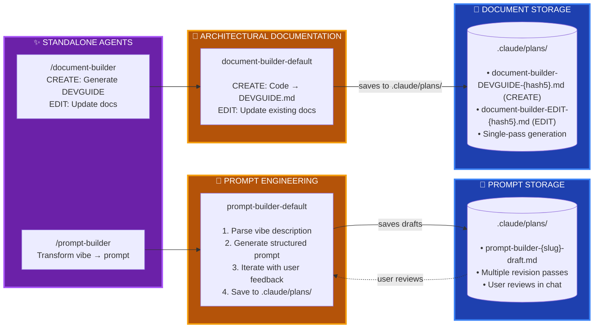

# Essentials for Claude Code

A comprehensive multi-agent orchestration framework for Claude Code. Features deep planning, bug investigation, code quality analysis (standard and LSP-powered), issue-based iterative implementation, parallel file editing capabilities, and hierarchical architectural documentation generation (DEVGUIDE.md).

## Core Concept: Multi-Agent Workflows

### Plan-Driven Workflow (with File-Editor Orchestration)


```mermaid
flowchart LR
    subgraph commands["🎯 USER COMMANDS"]
        direction TB
        planner_cmd["/planner<br/>Create plan"]
        optimizer_cmd["/plan-builder<br/>Refine plan"]
        bug_cmd["/bug-scout<br/>Fix bugs"]
        quality_cmd["/code-quality<br/>Standard analysis"]
        serena_cmd["/code-quality-serena<br/>LSP analysis"]
        issue_cmd["/task-builder<br/>Iterative mode"]
        editor_cmd["/editor<br/>Batch mode"]
    end

    subgraph analysis["📊 ANALYSIS AGENTS"]
        direction TB
        planner_agent["planner-default<br/>Create implementation plan"]
        optimizer_agent["plan-builder-default<br/>Refine with revisions"]
        bug_agent["bug-scout-default<br/>Investigate & plan fixes"]
        quality_agent["code-quality-default<br/>11-dimension analysis"]
        serena_agent["code-quality-serena<br/>LSP semantic analysis"]
        issue_agent["task-builder-default<br/>Break into tasks"]
    end

    subgraph storage["💾 PLAN STORAGE"]
        direction TB
        plans[(".claude/plans/<br/><br/>• {task}-plan.md<br/>• tasks-{hash}.json<br/>• bug-scout-plan.md<br/>• code-quality-plan.md")]
    end

    subgraph execution["⚙️ FILE-EDITOR ORCHESTRATION"]
        direction TB
        orchestrator["File-Editor Orchestrator<br/>Spawns parallel agents"]
        editor1["file-editor-default<br/>[edit] handler.ts"]
        editor2["file-editor-default<br/>[edit] middleware.ts"]
        editor3["file-editor-default<br/>[create] oauth.ts"]
    end

    %% Command to Agent connections
    planner_cmd --> planner_agent
    optimizer_cmd --> optimizer_agent
    bug_cmd --> bug_agent
    quality_cmd --> quality_agent
    serena_cmd --> serena_agent
    issue_cmd --> issue_agent
    editor_cmd --> plans

    %% Analysis agents to storage
    planner_agent -->|"writes"| plans
    optimizer_agent -->|"updates"| plans
    bug_agent -->|"writes"| plans
    quality_agent -->|"writes"| plans
    serena_agent -->|"writes"| plans
    issue_agent -->|"writes"| plans

    %% Storage to execution
    plans --> orchestrator

    %% Orchestrator to editors
    orchestrator -->|"spawn"| editor1
    orchestrator -->|"spawn"| editor2
    orchestrator -->|"spawn"| editor3

    %% Editor feedback (dotted)
    editor1 -.->|"done"| orchestrator
    editor2 -.->|"done"| orchestrator
    editor3 -.->|"done"| orchestrator

    style commands fill:#1e40af,stroke:#3b82f6,stroke-width:3px,color:#fff
    style analysis fill:#b45309,stroke:#f59e0b,stroke-width:3px,color:#fff
    style storage fill:#6b21a8,stroke:#a855f7,stroke-width:3px,color:#fff
    style execution fill:#065f46,stroke:#10b981,stroke-width:3px,color:#fff
    style orchestrator fill:#047857,stroke:#10b981,stroke-width:2px,color:#fff
    style plans fill:#7c3aed,stroke:#a855f7,stroke-width:2px,color:#fff
```

### Independent Workflow (No File-Editor)


```mermaid
flowchart LR
    subgraph standalone["✨ STANDALONE AGENTS"]
        prompt_cmd["/prompt-builder<br/>Transform vibe → prompt"]
        doc_cmd["/document-builder<br/>CREATE: Generate DEVGUIDE<br/>EDIT: Update docs"]
    end

    subgraph prompt_work["📝 PROMPT ENGINEERING"]
        prompt_agent["prompt-builder-default<br/><br/>1. Parse vibe description<br/>2. Generate structured prompt<br/>3. Iterate with user feedback<br/>4. Save to .claude/plans/"]
    end

    subgraph doc_work["📄 ARCHITECTURAL DOCUMENTATION"]
        doc_agent["document-builder-default<br/><br/>CREATE: Code → DEVGUIDE.md<br/>EDIT: Update existing docs"]
    end

    subgraph prompt_storage["💾 PROMPT STORAGE"]
        prompt_files[(".claude/plans/<br/><br/>• prompt-builder-{slug}-draft.md<br/>• Multiple revision passes<br/>• User reviews in chat")]
    end

    subgraph doc_storage["💾 DOCUMENT STORAGE"]
        doc_files[(".claude/plans/<br/><br/>• document-builder-DEVGUIDE-{hash5}.md (CREATE)<br/>• document-builder-EDIT-{hash5}.md (EDIT)<br/>• Single-pass generation")]
    end

    prompt_cmd --> prompt_agent
    prompt_agent -->|"saves drafts"| prompt_files
    prompt_files -.->|"user reviews"| prompt_agent

    doc_cmd --> doc_agent
    doc_agent -->|"saves to .claude/plans/"| doc_files

    style standalone fill:#6b21a8,stroke:#a855f7,stroke-width:3px,color:#fff
    style prompt_work fill:#b45309,stroke:#f59e0b,stroke-width:3px,color:#fff
    style prompt_storage fill:#1e40af,stroke:#3b82f6,stroke-width:3px,color:#fff
    style doc_work fill:#b45309,stroke:#f59e0b,stroke-width:3px,color:#fff
    style doc_storage fill:#1e40af,stroke:#3b82f6,stroke-width:3px,color:#fff
```

## Naming Pattern: Builder Agents

Agents with **"-builder"** in their name follow an **iterative loop pattern with user control** at each iteration:

### Builder Meta-Loop Pattern

All builders implement a systematic **iterative refinement loop** with clear separation of concerns:

#### Architectural Pattern: Slash Commands Orchestrate, Agents Create Artifacts

| Builder | **Slash Command Role** | **Agent Role** | User Control Point |
|---------|------------------------|----------------|-------------------|
| **`plan-builder`** | Orchestrates refinement loop | ONLY applies changes to plan file | After each refinement iteration |
| **`task-builder`** | Orchestrates task-by-task implementation | ONLY creates/updates tasks.json | After each task presented: [1] Implement, [2] Skip, [3] View details, [4] Pause/Compact, [5] Abort |
| **`prompt-builder`** | Orchestrates refinement loop | ONLY creates/updates prompt drafts | After each draft revision |
| **`document-builder`** | Detects mode (CREATE/EDIT) | CREATE: Generates DEVGUIDE from code patterns<br/>EDIT: Applies user changes to existing docs | N/A (single-pass execution) |

**Critical Separation of Concerns:**
- **Slash Commands (`.md` files in `commands/`)**: Handle ALL orchestration
  - Run loops (present task → wait for user → act on choice → repeat)
  - Use `AskUserQuestion` for user interaction
  - Spawn agents in background with `run_in_background: true`
  - Report minimal summaries to user
- **Agents (`.md` files in `agents/`)**: ONLY create/update artifacts
  - NO user interaction (never use `AskUserQuestion`)
  - NO orchestration loops
  - Apply changes, validate quality, write files
  - Return structured results to slash command

**Why This Pattern:**
- **Prevents double orchestration**: Agent doesn't spawn sub-agents or run loops
- **Clean resumability**: Slash command loads artifact state and resumes loop
- **Minimal context usage**: Agents output minimal data, full details in files
- **User control**: All interaction happens at command level

**Key Characteristics of All Builders:**
- **Iterative**: Work happens in discrete iterations/passes, not all at once
- **User-Driven**: User explicitly approves/rejects each iteration (via command's AskUserQuestion)
- **Resumable**: Can pause and resume from any iteration (command re-loads artifact state)
- **Incremental Progress**: Each iteration builds on previous results (artifacts updated in place)
- **Transparent**: User sees exactly what changed in each iteration (git-style diffs, revision history)
- **Controllable**: User can abort, skip, or request modifications mid-loop (command handles choices)

This contrasts with **non-builder agents** (planner, bug-scout, code-quality) which run to completion and present a single result for user review.

## Orchestrator Meta-Pattern

All **non-builder slash commands** (`/planner`, `/bug-scout`, `/editor`, `/code-quality`, `/code-quality-serena`) follow a consistent **orchestration meta-pattern** for spawning specialist agents, collecting results, and coordinating multi-step workflows:

### Orchestrator Architecture: Commands Coordinate, Agents Execute

| Orchestrator | **Command Role** | **Specialist Agent(s)** | **Auto-Dispatch File Editors?** |
|--------------|------------------|-------------------------|----------------------------------|
| **`/planner`** | Orchestrates planning workflow | `planner-default` creates plan | ❌ No (presents options to user) |
| **`/bug-scout`** | Orchestrates bug investigation & fix | `bug-scout-default` investigates → `file-editor-default` fixes | ✅ Yes (after risk validation) |
| **`/editor`** | Orchestrates parallel file editing | Multiple `file-editor-default` agents (one per file) | ✅ Yes (is the dispatcher itself) |
| **`/code-quality`** | Orchestrates quality analysis & fixes | `code-quality-default` analyzes → `file-editor-default` fixes | ✅ Yes (for files needing changes) |
| **`/code-quality-serena`** | Orchestrates LSP-powered analysis & fixes | `code-quality-serena` analyzes → `file-editor-default` fixes | ✅ Yes (for files needing changes) |

### Standardized Workflow Steps

All orchestrators follow this **9-step meta-framework**:

```
┌─────────────────────────────────────────────────────────────┐
│ Step 1: Parse and Validate Input                           │
│         - Parse $ARGUMENTS                                  │
│         - Validate file paths, plan files exist             │
│         - Prepare data for specialist agent                 │
└─────────────────────────────────────────────────────────────┘
                           │
                           ▼
┌─────────────────────────────────────────────────────────────┐
│ Step 2: Launch Specialist Agent(s) in Background           │
│         - Use Task tool with run_in_background: true        │
│         - Pass clear, structured prompts                    │
│         - Launch ALL agents in parallel (single message)    │
└─────────────────────────────────────────────────────────────┘
                           │
                           ▼
┌─────────────────────────────────────────────────────────────┐
│ Step 3: Wait for Specialist Completion                     │
│         - Use TaskOutput with block: true                   │
│         - Collect structured results                        │
│         - Extract plan paths, file lists, metrics           │
└─────────────────────────────────────────────────────────────┘
                           │
                           ▼
┌─────────────────────────────────────────────────────────────┐
│ Step 4: Parse Results / Risk Validation (if applicable)    │
│         - Extract plan file paths, change counts            │
│         - Group by action needed (e.g., needs changes/clean)│
│         - Risk gate: Ask user if CRITICAL or LOW confidence │
└─────────────────────────────────────────────────────────────┘
                           │
                           ▼
┌─────────────────────────────────────────────────────────────┐
│ Step 5: Auto-Dispatch File Editors (if applicable)         │
│         - Launch file-editor-default agents in parallel     │
│         - One agent per file needing changes                │
│         - Pass ONLY plan file path (avoid context pollution)│
└─────────────────────────────────────────────────────────────┘
                           │
                           ▼
┌─────────────────────────────────────────────────────────────┐
│ Step 6: Collect Editor Results (if applicable)             │
│         - Use TaskOutput for each file-editor               │
│         - Collect CHANGES COMPLETED counts                  │
│         - Aggregate security assessments, warnings          │
└─────────────────────────────────────────────────────────────┘
                           │
                           ▼
┌─────────────────────────────────────────────────────────────┐
│ Step 7: VERIFY ALL CHANGES IMPLEMENTED (CRITICAL)          │
│         - Compare: TOTAL CHANGES (plan) vs CHANGES COMPLETED│
│         - If mismatch: Re-dispatch for missed changes       │
│         - Loop until CHANGES COMPLETED == TOTAL CHANGES     │
└─────────────────────────────────────────────────────────────┘
                           │
                           ▼
┌─────────────────────────────────────────────────────────────┐
│ Step 8: Aggregated Verification (if applicable)            │
│         - Run project linters, formatters, type checkers    │
│         - Collect verification results                      │
└─────────────────────────────────────────────────────────────┘
                           │
                           ▼
┌─────────────────────────────────────────────────────────────┐
│ Step 9: Report Comprehensive Summary                       │
│         - Minimal output (details in plan files)            │
│         - Tables: files modified, verification status       │
│         - Next steps for user                               │
└─────────────────────────────────────────────────────────────┘
```

### Key Characteristics of All Orchestrators

1. **Single-Pass Execution**: Run to completion, no iterative loops (unlike builders)
2. **Minimal Context Pollution**: Commands don't read large files; agents do and write artifacts
3. **Parallel Agent Spawning**: Launch all specialist agents in one message for max performance
4. **Automatic File Editing**: Most orchestrators auto-dispatch `file-editor-default` for implementation
5. **Verification Loops**: Critical Step 7 ensures no changes are missed (re-dispatch if needed)
6. **Structured Reporting**: Users review artifacts (plan files, changes) directly, not chat output
7. **No User Interaction**: Orchestrators make best judgment and proceed autonomously (except risk gates)
8. **Git Safety**: Orchestrators never commit/push; all changes left for user review

### Critical Separation of Concerns

**Slash Commands** (`essentials/commands/*.md`):
- Orchestrate workflows, coordinate multiple agents
- Use `Task` and `TaskOutput` tools exclusively
- Handle argument parsing, validation, result aggregation
- Present summaries and options to users
- May use `AskUserQuestion` for risk validation gates

**Specialist Agents** (`essentials/agents/*-default.md`):
- Execute focused tasks (planning, investigation, analysis, editing)
- Create artifacts (plan files, edited code, analysis reports)
- Return minimal structured results to orchestrator
- NEVER interact with users (no `AskUserQuestion`)
- NEVER orchestrate sub-agents

### Orchestrator-Specific Variations

| Orchestrator | Unique Step | Purpose |
|--------------|-------------|---------|
| `/planner` | Step 1: Grammar check task description | Ensures clear, unambiguous planning input |
| `/planner` | Step 4: Present implementation options | User chooses `/editor`, `/task-builder`, or `/plan-builder` |
| `/bug-scout` | Step 1: Execute diagnostic commands | Runs `docker logs`, `journalctl` as requested |
| `/bug-scout` | Step 4: Risk validation gate | Asks user confirmation if CRITICAL severity or LOW confidence |
| `/editor` | Step 2: Pre-flight conflict check | Detects potential import conflicts, dependency order |
| `/code-quality*` | Step 4: Group by needs changes/clean | Skips file-editors for files already meeting 9.1/10 threshold |

### Why This Pattern

- **Predictability**: Every orchestrator follows same 9-step flow (easier to maintain)
- **Composability**: Orchestrators can be chained (e.g., `/planner` → `/editor`)
- **Reliability**: Verification loops ensure no changes are missed
- **Performance**: Parallel agent spawning maximizes throughput
- **Clarity**: Clear separation between orchestration (commands) and execution (agents)

This pattern complements the **Builder Meta-Loop Pattern** by providing a standardized approach for **fire-and-forget** workflows that don't require iterative user refinement.

## Features

### 1. **Planner** (`/planner`)
Comprehensive architectural planning agent with complete end-to-end planning workflow:

**Planning Process:**
- **Phase 1: Code Investigation** - Systematic codebase exploration using Glob/Grep/Read with file:line references
- **Phase 2: External Documentation Research** - MCP-based research (Context7, SearxNG) for API/library details
- **Phase 3: Synthesis** - Transform findings into detailed architectural narrative with stakeholder analysis
- **Phase 4: Per-File Instructions** - Precise implementation steps with exact signatures, line numbers, dependencies
- **Phase 5: 7-Pass Revision Process** - Quality assurance through multiple validation passes:
  - Pass 1: Initial Draft
  - Pass 2: Structural Validation (all required sections present)
  - Pass 3: Anti-Pattern Scan (eliminate vague phrases like "add appropriate", "as needed")
  - Pass 4: Dependency Chain Validation (every Dependency has a Provider, exact signature matching)
  - Pass 5: Consumer Simulation (file-editor agent perspective check)
  - Pass 6: Requirements Traceability (every requirement maps to file changes)
  - Pass 7: Final Quality Score (minimum 40/50 total, no dimension below 8/10)

**Plan Content:**
- Risk analysis with mitigation strategies and rollback plans
- Alternative approaches considered with trade-offs
- Testing strategy with unit/integration test requirements
- Success metrics and verification checklist
- Visual architecture diagrams (ASCII art)
- Complete revision history documenting all 7 passes

**Orchestration Workflow:**
- Grammar/spell checks user's task description before planning
- Launches `planner-default` agent in background
- Writes comprehensive plan to `.claude/plans/{task-slug}-{hash5}-plan.md`
- Guides user to choose implementation approach:
  - **Option 1**: `/plan-builder` - Refine plan with git-style revision tracking (optional)
  - **Option 2**: `/editor` - Batch mode for simple plans (<5 files)
  - **Option 3**: `/task-builder` - Iterative mode for complex plans (>5 files)

### 2. **Bug Scout** (`/bug-scout`)
Deep bug investigation with systematic analysis and automatic fix implementation:

**Orchestration Pattern**: Slash command orchestrates, agent ONLY investigates and creates plan
- **Command**: Parses log dumps/files, executes diagnostics, spawns `bug-scout-default` agent in background, waits for completion, validates risk gate, auto-dispatches `file-editor-default` agents in parallel, verifies all fixes implemented
- **Agent**: Investigates bug through 7 phases (0-7), writes plan to `.claude/plans/`, returns minimal output (severity, confidence, plan file path)

**Investigation Process (Agent - Phases 0-7):**
- **Phase 0: Error Signal Extraction** - Parse logs, stack traces, and diagnostic output to extract error signals
- **Phase 1: Project Context Gathering** - Read documentation (CLAUDE.md, README) and analyze recent git changes (view-only)
- **Phase 2: Code Path Tracing** - Map complete execution path from entry point to failure, track data flow
- **Phase 2.5: Reflection Checkpoint** - ReAct reasoning loop validates call chain completeness, evidence sufficiency, and suspicious section identification
- **Phase 3: Line-by-Line Deep Analysis** - Deep inspection of suspicious code sections with bug pattern detection (null checks, bounds, types, race conditions)
- **Phase 4: Regression Analysis Loop** - Identify what changed that broke things using git history and change impact mapping
- **Phase 4.5: Reflection Checkpoint** - ReAct reasoning loop validates root cause confidence (High/Medium/Low), evidence strength, and contributing factors
- **Phase 5: Fix Plan Generation** - Select fix strategy, generate precise specifications with exact file:line locations and before/after code
- **Phase 6: Write Plan to File** - Save comprehensive plan to `.claude/plans/bug-scout-{identifier}-{hash5}-plan.md`
- **Phase 7: Minimal Report to Orchestrator** - Return only essential metadata (severity, confidence, plan file path)

**Orchestration Workflow (Command - 9 Steps):**
- **Step 1: Parse and Validate Input** - Parse log dump (inline or file path), execute user-requested diagnostic commands (docker logs, journalctl, PID checks)
- **Step 2: Launch Specialist Agent** - Spawn `bug-scout-default` agent in background with `run_in_background: true`
- **Step 3: Wait for Completion** - Use `TaskOutput` with `block: true` to wait for investigation completion
- **Step 4: Risk Validation Gate** - Ask user confirmation if CRITICAL severity OR LOW confidence (auto-proceed otherwise)
- **Step 5: Auto-Dispatch File Editors** - Spawn `file-editor-default` agents in parallel (one per file, all in single message)
- **Step 6: Collect Editor Results** - Use `TaskOutput` to wait for each editor, collect CHANGES COMPLETED counts
- **Step 7: VERIFY ALL FIXES IMPLEMENTED** - Compare TOTAL CHANGES (plan) vs CHANGES COMPLETED (editors), re-dispatch for missed fixes, loop until counts match
- **Step 8: Aggregated Verification** - Run linters, formatters, type checkers (if specified in CLAUDE.md)
- **Step 9: Report Summary** - Comprehensive table of files modified, verification status, rollback instructions

**Key Features:**
- **Evidence-based conclusions**: Concrete proof (stack trace + code analysis + git history)
- **ReAct loops at checkpoints**: Self-critique at Phase 2.5 and 4.5 to avoid premature conclusions
- **Quality scoring**: 6-dimension rubric (Error Signal Extraction 15%, Code Path Tracing 20%, Line-by-Line Depth 20%, Regression Analysis 15%, Root Cause Confidence 15%, Fix Precision 15%) targeting 9-10/10
- **Severity levels**: Critical/High/Medium/Low with confidence tracking (High/Medium/Low)
- **View-only git commands**: diff, status, log, blame - never modifies repository state
- **Minimal context pollution**: All investigation details stay in plan file, orchestrator only passes plan file path to editors


### 3. **Code Quality** (`/code-quality` and `/code-quality-serena`)

Two complementary approaches for comprehensive code analysis:

#### **Standard Analysis** (`/code-quality`)
Comprehensive file-based code quality analysis with systematic 8-phase process (Phase 0 through Phase 7):

**8-Phase Analysis Process:**
- **Phase 0: Context Gathering** - Read project docs (CLAUDE.md, README, CONTRIBUTING, devguides), find consumers (files that import this), analyze sibling files and test files, extract project coding standards (naming, patterns, forbidden practices)
- **Phase 1: Code Element Extraction** - Catalog ALL code elements: imports (with usage tracking), globals/constants, classes (with methods, variables, decorators), functions (with parameters, locals, return types), type definitions (aliases, interfaces, protocols, enums)
- **Phase 2: Scope & Visibility Analysis** - Check private element usage correctness (underscore-prefixed, private keyword), audit public elements (actually used externally?), detect unused elements (including unused interfaces/types only referenced in unused parameters)
- **Phase 3: Call Hierarchy Mapping** - Build complete call graph (what calls what), identify entry points (not called by anything), find orphaned/dead code (defined but never called), detect circular/recursive dependencies
- **Phase 3.5: ReAct Reflection Checkpoint** - Self-verification before quality checks: element mapping complete? scope analysis accurate? call hierarchy correct? context aligned with project standards?
- **Phase 4: Quality Issue Identification** - Scan 16 categories across 11 quality dimensions:
  - Code smells (complexity, god class, feature envy, data class, naming issues, duplication, redundant conditionals, magic numbers)
  - Inheritance & composition analysis (depth, LSP violations, composition vs inheritance)
  - Type safety (missing types, inconsistencies, optional without null checks)
  - Best practices violations (language idioms, modern features, error handling, resource management)
  - SOLID principles (SRP, OCP, LSP, ISP, DIP)
  - DRY/KISS/YAGNI violations (duplication, over-engineering, speculative generality)
  - Performance & efficiency (memory leaks, algorithm complexity, N+1 queries, caching opportunities)
  - Concurrency & thread safety (race conditions, deadlock potential, async patterns)
  - Security vulnerabilities (OWASP Top 10: injection, auth, data exposure, input validation, dangerous functions)
  - Test quality & coverage (untested functions, test naming, flaky tests, >80% coverage target)
  - Architectural & design quality (coupling, cohesion, pattern violations, layer bypassing)
  - Documentation quality (API docs, code comments, module docs, staleness)
  - Code churn & stability metrics (high-churn files, hotspots, defect density)
  - Advanced code metrics (Halstead Volume/Difficulty/Effort/Bugs, ABC metrics, Maintainability Index, Depth of Inheritance, CBO, LCOM, RFC, WMC)
  - Technical debt estimation (code/design/test/doc debt, remediation hours, debt ratio, priority matrix)
  - Data flow & taint analysis (untrusted sources → sensitive sinks, sanitization gaps)
  - Project standards compliance (from Phase 0 context: documentation format, naming conventions, required/forbidden patterns)
  - Cross-file consistency (pattern alignment with dependencies, consumers, and sibling files)
- **Phase 4.5: ReAct Reflection Checkpoint** - Validate before generating plan: all 11 quality dimensions checked? every finding has evidence (file:line + code snippet)? false positives eliminated? improvements feasible for file-editors?
- **Phase 5: Improvement Plan Generation** - Prioritize issues (Critical/High/Medium/Low) by impact, create specific fixes with exact line numbers, include before/after code examples for complex changes
- **Phase 6: Write Plan to File** - Save complete analysis to `.claude/plans/code-quality-{filename}-{hash5}-plan.md` with all context, quality scores table, complexity metrics, code elements summary, issues categorized by priority, and per-file implementation steps with TOTAL CHANGES count
- **Phase 7: Minimal Report to Orchestrator** - Return only plan file path, current score, projected score, TOTAL CHANGES count, and priority level (avoids context pollution, full details in plan file)

**Core Principles:**
- **Context-driven analysis** - Always gather project standards before analyzing code
- **Comprehensive element mapping** - Outline ALL code elements (functions, classes, variables, imports)
- **Multi-dimensional quality assessment** - Evaluate across 11 quality dimensions (SOLID, DRY, KISS, YAGNI, OWASP, etc.)
- **ReAct reasoning loops** - Reason → Act → Observe → Repeat at each phase
- **Self-critique ruthlessly** - Question findings, verify with evidence, test alternatives
- **Evidence-based scoring** - Every quality issue must have concrete code examples
- **Project standards first** - Prioritize project conventions over generic best practices
- **Security awareness** - Always check for OWASP Top 10 vulnerabilities
- **Quality scoring validation** - Score on 11 dimensions, maintain minimum 9.1/10 target
- **Actionable recommendations** - Every suggestion must be specific with exact file:line locations

**Quality Scoring & Metrics:**
- **11-Dimension Scoring**: Code Organization (12%), Naming Quality (10%), Scope Correctness (10%), Type Safety (12%), No Dead Code (8%), No Duplication/DRY (8%), Error Handling (10%), Modern Patterns (5%), SOLID Principles (10%), Security/OWASP (10%), Cognitive Complexity (5%)
- **Advanced Metrics**: Cyclomatic complexity, Halstead metrics (Volume, Difficulty, Effort, Predicted Bugs), ABC metrics (Assignment/Branch/Condition), Maintainability Index, CBO (Coupling Between Objects), LCOM (Lack of Cohesion in Methods), RFC (Response for Complexity), WMC (Weighted Methods per Class)
- **Minimum 9.1/10 Target**: Adds fixes iteratively until projected score reaches threshold

**Auto-Implementation Workflow:**
- Spawns parallel file-editor agents (one per file needing fixes)
- Verification loop: CHANGES COMPLETED must equal TOTAL CHANGES from plan
- Re-dispatches for missed fixes with specific instructions
- Aggregated reporting with fix verification status

#### **LSP Semantic Analysis** (`/code-quality-serena`) ⭐ NEW
Advanced semantic code navigation using Serena LSP tools for comprehensive analysis:

**Orchestration Pattern**: Slash command orchestrates, agent ONLY creates artifact
- **Command**: Validates files, spawns parallel `code-quality-serena` agents in background, waits for completions, dispatches `file-editor-default` agents for improvements, verifies all fixes implemented
- **Agent**: Gathers context using LSP, analyzes file quality with semantic navigation, creates improvement plan file, returns minimal output (plan path + quality score)

**Core Serena LSP Tools Used:**
- `get_symbols_overview(relative_path, depth)` - Extract class/function hierarchy with line ranges and symbol kinds
- `find_symbol(name_path_pattern, include_kinds, include_body)` - Get specific symbol details with body content
- `find_referencing_symbols(name_path, relative_path)` - Find all uses of a symbol across files (cross-file references)
- `search_for_pattern(substring_pattern, relative_path)` - Regex search for code patterns (security, magic numbers, etc.)
- `find_file(file_mask, relative_path)` - Locate documentation and related files
- `list_dir(relative_path, recursive)` - Find sibling files in same directory
- `read_file(relative_path, start_line, end_line)` - Read file contents with line ranges

**8-Phase LSP Workflow with ReAct Reflection Checkpoints:**
- **Phase 0: Context Gathering (using Serena tools)**
  - Uses `find_file` to locate CLAUDE.md, README.md, CONTRIBUTING.md, devguides
  - Uses `search_for_pattern` to find files importing the target (consumer analysis)
  - Uses `list_dir` to find sibling files for consistency checking
  - Uses `find_file` to locate test files
  - Extracts coding conventions, naming standards, required/forbidden patterns from project docs
- **Phase 1: Code Element Extraction with LSP**
  - Uses `get_symbols_overview` to catalog ALL symbols with exact line ranges and symbol kinds
  - Type-aware analysis with LSP symbol kinds (5=Class, 6=Method, 11=Interface, 12=Function, 13=Variable)
  - Complete symbol hierarchy extraction with configurable depth
  - Uses `find_symbol` to analyze each symbol's signature, parameters, and body
  - Catalogs imports, classes (with methods/properties), functions, interfaces/types, global variables
- **Phase 2: Scope & Visibility Analysis with LSP**
  - Uses `find_referencing_symbols` for each public element to verify actual usage
  - Detects unused public API (verified against consumers from Phase 0)
  - Identifies scope violations with LSP-verified reference tracking
  - Cross-references with consumer imports to validate external API usage
  - Finds unused elements including interfaces/types only referenced in unused parameter signatures
- **Phase 3: Call Hierarchy Mapping with LSP**
  - Uses `find_referencing_symbols` to build accurate call graphs
  - Entry point identification (functions with no callers)
  - Orphaned code detection (unreachable functions, unused interfaces, dead code)
  - Circular/recursive call detection
- **Phase 3.5: ReAct Reflection Checkpoint**
  - Self-verification: element mapping complete with LSP? scope analysis accurate? call hierarchy correct? context aligned?
  - Validates LSP data completeness (all symbols found, all references checked)
  - Re-checks with LSP tools if gaps detected
  - Documents decision to proceed with quality issue identification
- **Phase 4: Quality Issue Identification (11 Dimensions)**
  - Code smells detection using LSP data (god classes via method counts, function complexity via symbol analysis)
  - Type safety analysis with LSP symbol signatures (missing types, inconsistencies)
  - Performance issues (memory leaks via reference tracking, N+1 queries via `search_for_pattern`, algorithm complexity)
  - Concurrency & thread safety (race conditions, deadlocks, async patterns)
  - Test quality & coverage using LSP to find untested symbols (>80% target)
  - Architectural quality (coupling via `find_referencing_symbols`, cohesion via LCOM with LSP)
  - Security analysis using `search_for_pattern` for OWASP Top 10 vulnerability patterns (injection, auth, data exposure)
  - Advanced metrics with LSP data: Halstead (Volume, Difficulty, Effort, Bugs), ABC (Assignment/Branch/Condition), CBO (coupling), LCOM (cohesion), RFC, WMC, Maintainability Index
  - Project standards compliance (from Phase 0 context: documentation format, naming conventions, required/forbidden patterns)
  - Cross-file consistency (pattern alignment with dependencies, consumers, and sibling files)
  - Evidence-based findings with exact file:line references from LSP tools
- **Phase 4.5: ReAct Reflection Checkpoint**
  - Validate: all 11 dimensions checked? every finding has LSP-verified evidence? false positives eliminated? improvements feasible?
  - Self-critique before generating improvement plan
  - Verifies improvement suggestions won't break dependencies (checks with `find_referencing_symbols`)
  - Documents analysis confidence level and justification
- **Phase 5: Improvement Plan Generation**
  - Prioritized issues (Critical/High/Medium/Low) with before/after code examples
  - LSP tool attribution for each finding (e.g., "found via find_referencing_symbols showed zero usage")
  - **Minimum 9.1/10 Target**: Adds fixes iteratively until projected score reaches threshold
  - Consumer-first thinking: ensures file-editors can implement without questions
  - Includes summary statistics (Critical/High/Medium/Low counts, unused elements, dead code, scope violations)
- **Phase 6: Write Plan to File**
  - Saves to `.claude/plans/code-quality-serena-{filename}-{hash5}-plan.md` (5-character random hash)
  - Includes LSP analysis summary (symbols found by type, references checked, unused elements)
  - Complete context for file-editors (no need to reference original file)
  - Implementation plan with per-file changes, TOTAL CHANGES count, dependencies, exact line numbers
  - Quality scores table (current vs projected after fixes, must be ≥9.1)
- **Phase 7: Report to Orchestrator (Minimal Output)**
  - Returns only essential metadata: plan file path, current score, projected score, TOTAL CHANGES count, priority level
  - Structured format with LSP analysis stats (symbols analyzed, references checked, unused elements found)
  - Avoids context pollution - all investigation details stay in plan file
  - Includes declaration checklist: analysis complete, ready for file-editor-default

**LSP Advantages Over Standard Analysis:**
- **Semantic accuracy**: Understands language structure via LSP, not just text patterns
- **Cross-file reference tracking**: `find_referencing_symbols` finds all uses of a symbol across the codebase
- **Zero false positives for dead code**: LSP verifies zero references with compiler-grade accuracy
- **Consumer verification**: Checks if public API is actually used by importing files (Phase 0 consumer analysis)
- **Better refactoring confidence**: Changes backed by precise LSP dependency data
- **Type-aware analysis**: Leverages LSP symbol kinds for accurate classification
- **Better dead code detection**: Even finds interfaces only used in unused parameter signatures

**Quality Scoring (11 Dimensions):**
- Same as standard analysis: Code Organization (12%), Naming Quality (10%), Scope Correctness (10%), Type Safety (12%), No Dead Code (8%), No Duplication/DRY (8%), Error Handling (10%), Modern Patterns (5%), SOLID Principles (10%), Security/OWASP (10%), Cognitive Complexity (5%)
- All scores backed by LSP-verified evidence

**Auto-Implementation Workflow:**
- Spawns `code-quality-serena` agents in background (one per file)
- Auto-dispatches `file-editor-default` agents in parallel for files needing fixes
- Verification loop: CHANGES COMPLETED must equal TOTAL CHANGES
- Re-dispatches for missed fixes with specific instructions

### 4. **File Editor** (`/editor`)
Parallel file editing and creation from implementation plans:
- **Parallel execution**: Spawns multiple file-editor agents in the background, one per file
- **Dual mode operation**:
  - `[edit]` mode: Uses Edit tool for precise modifications to existing files
  - `[create]` mode: Uses Write tool to generate complete, functional new files
- **Pre-implementation validation**: Verifies file state before changes (existence checks, parent directory validation)
- **Security-first**: Applies comprehensive security checklist (input validation, injection prevention, auth checks)
- **Defensive coding**: Error handling standards, boundary checks, safe defaults
- **Regression loop**: Mandatory post-edit cleanup (removes unused code, resolves TODOs, eliminates stale patterns)
- **Verification workflow**: Compares CHANGES COMPLETED vs TOTAL CHANGES from plan, re-dispatches if mismatches found
- **Detailed reporting**: Aggregates metrics (lines changed, security assessment, merge conflicts) from all parallel agents
- **Best for**: Simple plans (<5 files), batch execution, single session

### 5. **Task Builder** (`/task-builder`) ⭐ NEW
Task-based iterative implementation with parallel file editing and comprehensive context:
- **Orchestration Pattern**: Slash command orchestrates task-by-task loop, agent ONLY creates/updates tasks.json
  - Command: Presents tasks to user (AskUserQuestion), spawns file-editors in parallel, verifies completion, manages state
  - Agent (DECOMPOSE mode): Reads plan, breaks into self-contained tasks, writes tasks.json with 6-pass revision
  - Agent (RESUME mode): Command skips agent entirely, loads tasks.json directly and orchestrates
- **Plan Decomposition**: Breaks plans into trackable, atomic tasks with dependency graph
- **Self-Contained Tasks**: Each task embeds COMPLETE implementation details from the plan:
  - Full code snippets (can be hundreds of lines per file)
  - Complete architectural context, requirements (R-IDs), and constraints (C-IDs)
  - Testing strategies, risk mitigations, and external documentation
  - File-editor agents never need to reference the original plan
- **Iterative Workflow**: Command presents one task at a time with user approval via AskUserQuestion
  - Options: [1] Implement, [2] Skip, [3] View details, [4] Pause/Compact, [5] Abort
- **Parallel File-Editors**: Command spawns file-editor agents in parallel (one per file in each task)
- **User Control**: After each task, choose to continue/pause/compact/abort (command handles loop)
- **Pause/Resume**: Can pause, run `/compact`, then resume exactly where you left off (command re-loads tasks.json)
- **Regression Testing**: Command runs tests after each task to catch breakage early
- **Full Verification**: Command verifies per task (CHANGES COMPLETED == TOTAL CHANGES)
- **Complete Audit Trail**: All progress tracked in tasks.json (agent creates, command updates)
- **Best for**: Complex plans (>5 files), unclear dependencies, resumable work, context management

### 6. **Plan Builder** (`/plan-builder`) ⭐ NEW
Iterative plan refinement with surgical precision and git-style revision tracking:
- **Orchestration Pattern**: Slash command orchestrates, agent ONLY applies changes to plan
  - Command: Handles user interaction, can add validation for empty instructions
  - Agent: Reads plan, applies changes, validates, writes updated plan with revision history
- **Multi-pass revision workflow**: Analyzes impact, applies changes through structured validation passes with reflection checkpoints (ReAct loops)
- **Surgical precision**: Changes only what's requested, plus necessary cascading updates to maintain consistency across all plan sections
- **Git-style revision history**: Complete audit trail with diff notation (+/-), context lines, impact summaries, quality score tracking, and validation status
- **Integrity validation**: Multi-pass validation ensures dependencies, requirements traceability, and structural consistency remain intact
- **Quality preservation**: Re-scores plans after changes, maintains minimum 40/50 quality threshold across 5 dimensions
- **Agent makes best judgment**: If instructions ambiguous, agent interprets and documents assumptions in revision notes (no AskUserQuestion in agent)
- **Best for**: Iterative plan refinement, adding missing details, reorganizing sections, tracking plan evolution over multiple revisions

### 7. **Prompt Builder** (`/prompt-builder`)
Iterative prompt engineering from vibe descriptions with multi-pass quality validation:
- **Orchestration Pattern**: Slash command orchestrates refinement loop, agent ONLY creates/updates prompts
  - Command: Validates vibe input (AskUserQuestion if too short), orchestrates refinement loop, reports updates
  - Agent: Transforms vibe into prompt, applies 6-pass validation, updates draft based on feedback
- **Vibe transformation**: Transforms rough ideas into high-quality, structured prompts
- **Anti-pattern elimination**: Removes vague phrases like "as needed", "etc.", "handle appropriately"
- **6-pass validation process**: Structural validation, anti-pattern scan, consumer simulation, quality scoring (≥40/50 target), final review
- **Reflection checkpoints**: ReAct reasoning loops validate clarity and actionability before proceeding
- **Iterative refinement**: User provides feedback in chat, command launches agent to refine, agent re-runs validation passes, updates draft
- **Quality scoring**: 5-dimension assessment (Clarity, Specificity, Completeness, Actionability, Best Practices)
- **Minimal output**: Agent returns only DRAFT_FILE, ITERATION, STATUS - user reviews file directly, no bloat in chat
- **Best for**: Creating Claude Code slash commands, subagent prompts, prompt engineering with systematic quality control

### 8. **Document Builder** (`/document-builder`) ⭐ NEW
Hierarchical architectural documentation (DEVGUIDE.md) generation and editing:
- **Two Modes**:
  - **CREATE mode** (default): Generate hierarchical DEVGUIDE.md files from code pattern analysis
  - **EDIT mode**: Edit existing documentation based on user requests
- **Orchestration Pattern**: Slash command orchestrates, agent ONLY analyzes/edits and creates documentation
  - Command: Parses arguments (--mode=create|edit, path), launches agent in background, reports results
  - Agent CREATE: Analyzes directory structure, extracts architectural patterns, generates DEVGUIDE.md
  - Agent EDIT: Reads existing document, applies user changes, maintains structure
- **Architectural focus**: Generates architecture guides showing patterns, not code documentation
- **CREATE Mode Process**:
  - Phase 1: Directory analysis (detect language, framework, directory type, sub-directories)
  - Phase 2: Code pattern extraction (class/function patterns, structural templates, design patterns)
  - Phase 3: Architecture identification (architectural layers, best practices, template examples)
  - Phase 4: DEVGUIDE generation (Overview → Sub-folder guides → Templates → Patterns → Best practices → Summary)
  - Phase 5: Quality validation (architectural focus, language-agnostic templates, valid cross-references)
  - Phase 6: Write DEVGUIDE file
- **EDIT Mode Process**:
  - Phase 1: Read existing document (parse structure, formatting, cross-references)
  - Phase 2: Analyze user request (identify sections to modify, new sections to add)
  - Phase 3: Apply changes (modify sections, add new content, maintain style)
  - Phase 4: Validate edits (verify changes match request, structure maintained, cross-references valid)
  - Phase 5: Write updated document
- **DEVGUIDE Template Structure**:
  - Overview (directory purpose and architecture)
  - Sub-folder Guides (cross-references to sub-directory DEVGUIDeS)
  - Templates (code templates with comment dividers: // ============================================================================)
  - Design Patterns (architectural patterns identified from code)
  - Best Practices (identified from code organization)
  - Directory Structure (visual tree with explanations)
  - Summary (key takeaways and links)
- **Language-agnostic templates**: Show architectural structure, not implementation details
- **Cross-referencing**: Links to sub-directory DEVGUIDeS for hierarchical organization
- **Minimal output**: Agent returns only OUTPUT_FILE, STATUS, MODE - user reviews file directly
- **Best for**: Creating hierarchical architectural documentation, documenting design patterns, establishing coding standards, onboarding documentation

## Installation

### Step 1: Add the Marketplace

```bash
/plugin marketplace add GantisStorm/essentials-claude-code
```

### Step 2: Install the Plugin

```bash
/plugin install essentials@essentials-claude-code
```

Or enable in `.claude/settings.local.json`:

```json
{
  "enabledPlugins": {
    "essentials@essentials-claude-code": true
  }
}
```

### Step 3: Create Required Directories (in your project)

The agents need these directories in your project:

```bash
mkdir -p .claude/plans
mkdir -p .claude/skills
```

### Step 4: Create Project-Specific Code Quality Skill

Create `.claude/skills/code-quality.md` tuned to your project's tooling:

```markdown
# Code Quality

Run code quality checks for this project.

## Commands

```bash
# Linting and formatting
your-linter . --fix
your-formatter .

# Type checking
your-type-checker
```

## Configuration

- Line length: [your limit]
- Linter config: [your config file]
- Type checker config: [your config file]
```

This skill is referenced by the code-quality agents to run your project's specific quality checks.

### Step 5 (Optional): Set Up Serena LSP for Semantic Analysis

To use `/code-quality-serena`, you need Serena MCP configured:

1. **Install Serena MCP**: Follow [Serena installation docs](https://github.com/toolness/serena)
2. **Configure for your project**: Serena will use LSP servers for your languages
3. **Test**: Verify LSP is working with a simple symbol search

Once configured, `/code-quality-serena` will use semantic code navigation for more accurate analysis.

## Usage

### Planning & Implementation

```bash
# Create an implementation plan
/planner Add OAuth2 authentication with Google login

# (Optional) Optimize/refine the plan before implementation
/plan-builder .claude/plans/oauth2-a3f9e-plan.md "Add error handling details to auth handler section"
/plan-builder .claude/plans/oauth2-a3f9e-plan.md "Update implementation order to do database setup first"

# After planning (and optional optimization), choose implementation approach:

# Option 1: Batch mode - all files in parallel
/editor .claude/plans/oauth2-a3f9e-plan.md src/auth/handler src/auth/middleware src/auth/oauth_provider

# Option 2: Iterative mode - one task at a time with user control
# Creates tasks.json and presents each task for approval
# After each task: choose to continue/pause/compact/abort
/task-builder .claude/plans/oauth2-a3f9e-plan.md

# Resume interrupted task-based implementation (pass tasks.json, not plan!)
/task-builder .claude/plans/tasks-a3f9e.json
```

### Bug Investigation

```bash
# Investigate and fix a bug
/bug-scout "TypeError: 'NoneType' object at auth_handler.py:45" "Login fails when user has no profile"

# With log file
/bug-scout ./logs/error.log "API returns 500 on POST /users"
```

### Code Quality

```bash
# Standard analysis (Read/Glob/Grep)
/code-quality src/services/auth src/services/user src/models/user

# LSP semantic analysis (more accurate)
/code-quality-serena src/services/auth src/services/user src/models/user

# Single file analysis
/code-quality src/services/payment
/code-quality-serena src/services/payment
```

### Prompt Building

```bash
# Create a new prompt from a vibe
/prompt-builder "a prompt that reviews PRs for security issues"

# Refine based on feedback
"add more OWASP examples and focus on injection attacks"

# When satisfied
"done"
```

### Document Building

```bash
# CREATE MODE: Generate hierarchical DEVGUIDeS

# Generate DEVGUIDE for current directory (default mode)
/document-builder .

# Generate DEVGUIDE for services directory
/document-builder src/services/

# Generate DEVGUIDE for components directory
/document-builder frontend/src/components/

# Explicit create mode
/document-builder --mode=create src/lib/

# Generate hierarchical DEVGUIDeS for entire project
# (run for root, then each sub-directory)
/document-builder backend/
/document-builder backend/src/
/document-builder backend/src/services/
/document-builder backend/src/controllers/

# EDIT MODE: Update existing documentation

# Add new section to existing DEVGUIDE
/document-builder --mode=edit src/services/DEVGUIDE.md "Add SSE pattern template"

# Update architecture section
/document-builder --mode=edit backend/DEVGUIDE.md "Update service architecture to include new orchestration pattern"

# Add new component pattern
/document-builder --mode=edit src/components/DEVGUIDE.md "Add skeleton component pattern with examples"

# Fix cross-references
/document-builder --mode=edit src/lib/DEVGUIDE.md "Update sub-folder guide links"

# Output is saved in .claude/plans/ - review and move to target directory
```

## Architecture

### Agent Hierarchy

```
Orchestrator Commands
├── /planner
│   └── planner-default (investigation + planning → guides user to /plan-builder, /editor, or /task-builder)
│
├── /plan-builder ⭐ NEW
│   └── plan-builder-default (user-guided plan refinement with git-style revision tracking)
│
├── /editor
│   └── file-editor-default (parallel, per-file, batch mode)
│
├── /task-builder ⭐ NEW
│   ├── task-builder-default (breaks plan into tasks, iterative orchestration with user control)
│   └── file-editor-default (parallel per task: one file-editor agent per file)
│
├── /bug-scout
│   ├── bug-scout-default (investigation + fix plan)
│   └── file-editor-default (parallel, per-file)
│
├── /code-quality
│   ├── code-quality-default (standard analysis + plan)
│   └── file-editor-default (parallel, per-file)
│
├── /code-quality-serena ⭐
│   ├── code-quality-serena (LSP semantic analysis + plan)
│   └── file-editor-default (parallel, per-file)
│
├── /prompt-builder
│   └── prompt-builder-default (iterative refinement)
│
└── /document-builder ⭐ NEW
    └── document-builder-default (CREATE: generate DEVGUIDE from patterns | EDIT: apply user changes)
```

### Plan Storage

All plans are stored in **your project's** `.claude/plans/` directory (not the plugin):
- `{task-slug}-{hash5}-plan.md` - Implementation plans (from /planner)
  - **Modified by /plan-builder**: Revisions tracked in git-style format at end of file ⭐ NEW
- `tasks-{hash5}.json` - Task breakdown files (from /task-builder) ⭐ NEW
- `bug-scout-{identifier}-{hash5}-plan.md` - Bug fix plans (from /bug-scout)
- `code-quality-{filename}-{hash5}-plan.md` - Quality improvement plans (from /code-quality standard)
- `code-quality-serena-{filename}-{hash5}-plan.md` - Quality improvement plans (from /code-quality-serena LSP)
- `prompt-builder-{slug}-draft.md` - Prompt drafts (from /prompt-builder)
- `document-builder-DEVGUIDE-{hash5}.md` - DEVGUIDE drafts (from /document-builder CREATE mode) ⭐ NEW
- `document-builder-EDIT-{hash5}.md` - Updated docs (from /document-builder EDIT mode) ⭐ NEW

## Directory Structure

```
essentials/
├── agents/
│   ├── bug-scout-default.md        # Bug investigation agent
│   ├── code-quality-default.md     # Code analysis agent (standard)
│   ├── code-quality-serena.md      # Code analysis agent (LSP-powered) ⭐
│   ├── file-editor-default.md      # File modification agent
│   ├── task-builder-default.md    # Task-based implementation agent ⭐ NEW
│   ├── plan-builder-default.md   # Plan refinement agent ⭐ NEW
│   ├── planner-default.md          # Planning agent
│   ├── prompt-builder-default.md   # Prompt engineering agent
│   └── document-builder-default.md # Documentation generation agent ⭐ NEW
└── commands/
    ├── bug-scout.md                # /bug-scout command
    ├── code-quality.md             # /code-quality command
    ├── code-quality-serena.md      # /code-quality-serena command ⭐
    ├── editor.md                   # /editor command
    ├── task-builder.md            # /task-builder command ⭐ NEW
    ├── plan-builder.md           # /plan-builder command ⭐ NEW
    ├── planner.md                  # /planner command
    ├── prompt-builder.md           # /prompt-builder command
    └── document-builder.md         # /document-builder command ⭐ NEW
```

## Key Design Principles

1. **Parallel Execution**: File-editor agents run in parallel for multi-file edits and creations
2. **Plan-Driven**: All complex work flows through plan files in `.claude/plans/`
3. **Edit or Create**: Plans specify `[edit]` for modifications and `[create]` for new files
4. **Minimal Context Pollution**: Agents return minimal output; details stay in plan files
5. **Verification Loops**: All implementations are verified against plan counts
6. **No Git Modifications**: Agents never commit; user reviews and commits manually
7. **Security-First**: All file edits include security checklist verification
8. **Semantic Accuracy** (LSP): Use language servers for accurate code understanding

## Requirements

- **Claude Code** - The CLI for orchestration and execution
- **Node.js 18+** - For running Claude Code
- **Serena MCP** (optional) - For `/code-quality-serena` LSP analysis

## License

MIT
